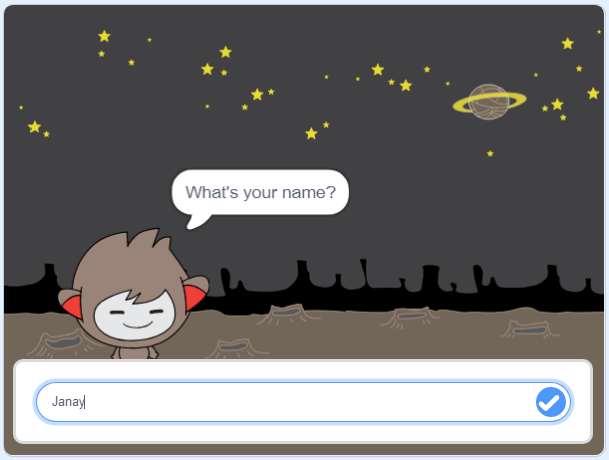

\--- geen druk \---

Dit is die **Scratch 3** weergawe van die projek. Daar is ook 'n [Scratch 2 weergawe van die projek](https://projects.raspberrypi.org/en/projects/chatbot-scratch2).

\--- / geen druk \---

## inleiding

Jy gaan leer hoe om 'n karakter wat met jou kan praat, te programmeer! 'N karakter soos dit word 'n klets robot genoem, of chatbot.

### Wat jy sal maak

\--- geen druk \---

Klik op die groen vlag en klik dan op die chatbot-karakter om 'n gesprek te begin. Wanneer die chatbot 'n vraag vra, tik jou antwoord in die kassie onderaan die stadium en klik dan op die blou merk regs (of druk `Enter`) om die antwoord van die chatbot te sien.

  <iframe allowtransparency="true" width="485" height="402" src="https://scratch.mit.edu/projects/embed/248864190/?autostart=false" 
  frameborder="0" scrolling="no"></iframe>

\--- / geen druk \---

\--- slegs druk \---

\--- / slegs druk \---

## \--- collapse \---

## title: What you will need

### Hardware

- Rekenaar wat Kras 3 kan uitvoer

### sagteware

- Kras 3 (óf [aanlyn](https://rpf.io/scratchon) of [vanlyn](https://rpf.io/scratchoff))

### downloads

- [Vind lêers om hier af te laai](http://rpf.io/p/en/chatbot-go).

\--- /collapse \---

## \--- collapse \---

## title: What you will learn

- Use code to concatenate strings in Scratch
- Weet dat veranderlikes gebruik kan word om gebruikersinvoer op te slaan
- Use conditional selection to respond to user input in Scratch

\--- /inval \---

## \--- collapse \---

## title: Additional notes for educators

\--- no-print \---

If you need to print this project, please use the [printer-friendly version](https://projects.raspberrypi.org/en/projects/chatbot/print){:target="_blank"}.

\--- /no-print \---

You can find the [completed project here](http://rpf.io/p/en/chatbot-get).

\--- /collapse \---