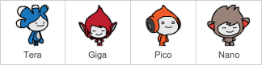

## Jou chatbot

\--- taak \---

Voordat jy begin met die skep van jou chatbot, moet jy besluit wat sy persoonlikheid is. **Dink aan die volgende vrae**:

+ Wat is die naam van die chatbot?
+ Waar woon dit?
+ Is dit gelukkig? Ernstig? Snaaks? Skaam? Vriendelik?
+ Wat hou dit van en hou nie van?

\--- / taak \---

\--- taak \--- Maak die Chatbot Scratch-aanvangsprojek oop.

**Aanlyn:** die voorgeregsprojek oop by [rpf.io/chatbot-on](http://rpf.io/chatbot-on){: target = "_ blank"}.

As jy 'n Scratch-rekening het, kan jy 'n kopie maak deur **Remix**klik.

**Vanlyn:** laai die aanvangsprojek van [rpf.io/p/en/chatbot-go](http://rpf.io/p/en/chatbot-go){: target = "_ blank"} af en open dit dan met die offline redakteur.

As u die Scratch offline redakteur moet aflaai en installeer, kan u dit by [https://rpf.io/scratchoff](rpf.io/scratchoff). \--- / taak \---

\--- taak \---

Die voorgeregsprojek bevat vier karakters. Een van hierdie sal jou chatbot wees.

Jy kan ook die sprite wat reeds gekies is gebruik, of 'n ander een kies deur regs te kliek op die een wat jy wil hê en dan **kies** of **versteek** in die kieslys wat verskyn.

\--- / taak \---