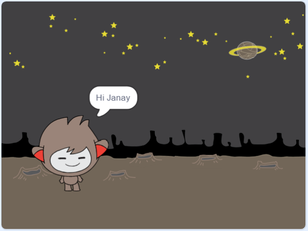

## 'N Praatjie chatbot

Noudat jy 'n chatbot met 'n persoonlikheid het, gaan jy dit programmer om met jou te praat.

\--- taak \---

Klik op jou chatbot-sprite en voeg hierdie kode by sodat `as dit`gekliek word: {2: class = "block3events"}, vra `vir jou naam`{: class = "block3sensing"} en dan `sê "Wat 'n pragtige naam! "`{: class = "block3looks"}.


```blocks3
wanneer hierdie sprite geklik het
vra [Wat is jou naam?] en wag
sê [Wat 'n lieflike naam!] vir (2) sekondes
```

\--- / taak \---

\--- taak \---

Klik op jou chatbot om jou kode te toets. Wanneer die chatbot vir jou naam vra, tik dit in die boks wat onderaan die stadium verskyn, en klik dan op die blou punt, of druk <kbd>Enter</kbd>.


\--- / taak \---

\--- taak \---

Op die oomblik antwoord jou chatbot "Wat 'n pragtige naam!" elke keer as jy antwoord. U kan die chatbot se antwoord persoonliker maak sodat die antwoord elke keer anders is as 'n ander naam ingevoer word.

Verander die chatbot sprite se kode om `by`{: class = "block3operators"} "Hi" te wees met die `antwoord`{: class = "block3sensing"} na die "Wat is jou naam?" vraag, sodat die kode só lyk:


```blocks3
wanneer hierdie sprite geklik het
vra [Wat is jou naam?] en wag
sê (sluit aan [Hi] (antwoord) :: +) vir (2) sekondes
```



\--- / taak \---

\--- taak \---

Deur die antwoord in 'n **veranderlike**, kan jy dit oral jou projek gebruik.

Skep 'n nuwe veranderlike genaamd `naam`{: class = "block3variables"}.

[[[generic-scratch3-add-variable]]]

\--- / taak \---

\--- taak \---

Verander nou jou chatbot sprites se kode om die `naam`{: class = "block3variables"} veranderlike te stel na `antwoord`{: class = "block3sensing"}:


```blocks3
wanneer hierdie sprite geklik het
vra [Wat is jou naam?] en wag

+ stel [naam v] na (antwoord)
sê (sluit aan [Hi] (naam :: veranderlikes +)) vir (2) sekondes
```

Jou kode moet werk soos voorheen: jou chatbot moet sê hi met die naam wat jy ingetik het.


\--- / taak \---

Toets jou program weer. Let daarop dat die antwoord wat u ingevoer word, in die `naam`{: class = "block3variables"} veranderlike gestoor word en ook in die boonste linkerhoek van die stadium vertoon word. Om dit van die stadium te laat verdwyn, gaan na die `Data`{: class = "block3variables"} blokke afdeling en klik die blokkie langs `naam`{: class = "block3variables"} sodat dit nie gemerk is nie.