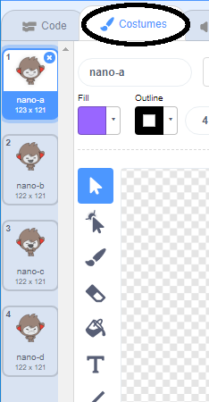

## Besluite neem

Jy kan jou chatbot programmeer om te besluit wat om te doen, gebaseer op die antwoorde wat dit ontvang.

Eerstens gaan jy jou chatbot maak. Stel 'n vraag wat met 'ja' of 'nee' beantwoord kan word.

\--- taak \---

Verander jou chatbot se kode. Jou chatbot moet die vraag "Is jy OK naam", met die `naam`{: class = "block3variables"} veranderlike. Dan moet dit antwoord: "Dis lekker om te hoor!" `as`{: class = "block3control"} die antwoord wat dit ontvang is "ja", maar sê niks as die antwoord nee is nie.


```blocks3
wanneer hierdie sprite geklik het
vra [Wat is jou naam?] en wag
stel [naam v] na (antwoord)
sê (sluit by [Hi] (naam)) vir (2) sekondes
+ vra (sluit aan [Is jy OK] (naam)) en wag
+ as <(antwoord) = [yes]> dan 
  sê [Dis lekker om te hoor!] vir (2) sekondes
einde
```

Om u nuwe kode behoorlik te toets, moet u dit **keer twee keer toets**: een keer met die antwoord 'ja' en een keer met die antwoord 'nee'.

\--- / taak \---

Op die oomblik sê jou chatbot niks vir die antwoord "nee" nie.

\--- taak \---

Verander jou chatbot se kode sodat dit antwoord "O nee!" as dit "nee" ontvang as die antwoord op "Is jy OK naam".

Vervang die `as, dan blokkeer`{: class = "block3control"} met 'n `indien, dan nog`(: class = "block3control") blok en sluit kode in sodat die chatbot `"Oh no!" Kan sê.`{: class = "block3looks"}.


```blocks3
wanneer hierdie sprite geklik het
vra [Wat is jou naam?] en wag
stel [naam v] na (antwoord)
sê (sluit by [Hi] (naam)) vir (2) sekondes
vra (sluit aan [Is jy OK] naam)) en wag

+ as <(antwoord) = [yes]> dan 
  sê [Dit is goed om te hoor!] vir (2) sekondes
anders 
+ sê [O nee!] vir (2) sekondes
einde
```

\--- / taak \---

\--- taak \---

Toets jou kode. Jy moet 'n ander antwoord kry as jy 'nee' antwoord en wanneer jy 'ja' antwoord: jou chatbot moet antwoord met 'Dit is goed om te hoor!' wanneer jy 'ja' antwoord (wat nie hooflettergevoelig is nie) en antwoord met 'O nee!' wanneer jy **enigiets anders antwoord**.


\--- / taak \---

Jy kan enige kode in 'n `as daar dan nog`blokkie {: class = "block3control"} is, nie net kode om jou chatbot te laat praat nie!

As jy op jou Chatbot se **Kostuums** oortjie kliek, sal jy sien dat daar meer as een kostuum is.



\--- taak \---

Verander jou chatbot se kode sodat die chatbot kostuums skakel wanneer jy jou antwoord invoer.


Verander die kode binne die `as dan nog`{: class = "block3control"} blokkeer na `skakelaarkostuum`{: class = "block3looks"}.


```blocks3
wanneer hierdie sprite geklik het
vra [Wat is jou naam?] en wag
stel [naam v] na (antwoord)
sê (sluit by [Hi] (naam)) vir (2) sekondes
vra (sluit aan [Is jy OK] naam)) en wag
as <(antwoord) = [yes]> dan 

+ skakel kostuum na (nano-c v)
  sê [Dit is goed om te hoor!] vir (2) sekondes
anders 
+ skakel kostuum na (nano- d v)
  sê [O nee!] vir (2) sekondes
einde
```

Toets en stoor jou kode. Jy moet jou chatbot se gesigsverandering sien, afhangende van jou antwoord.

\--- / taak \---

Het jy opgelet dat dit na jou chatbot se kostuum verander het, bly so bly en verander nie terug na wat dit was aan die begin nie?

U kan dit uitprobeer: voer u kode uit en antwoord "nee" sodat u chatbot se gesig verander na 'n ongelukkige voorkoms. Voer dan jou kode weer uit en let op dat jou chatbot nie terug verander om gelukkig te lyk voordat dit jou naam vra nie.


\--- taak \---

Om hierdie probleem op te los, voeg by die chatbot se kode by `skakel kostuum`(: class = "block3looks"} aan die begin `wanneer die sprite gekliek word`{: class = "block3events"}.


```blocks3
wanneer hierdie sprite

+ skakel kostuum na (nano-a v)
vra [Wat is jou naam?] en wag
```


\--- / taak \---