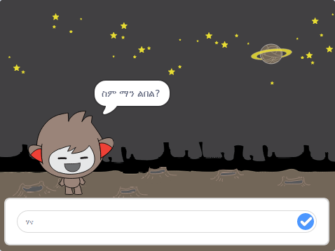

\--- no-print \---

ይህ የፕሮጀክቱ **ስክራች 3 ** ስሪት ነው። በተጨማሪም [ የፕሮጀክቱ ስክራች 2 ስሪት](https://projects.raspberrypi.org/en/projects/chatbot-scratch2) ይገኛል።

\--- / no-print \---

## መግቢያ

ከእርስዎ ጋር ሊነጋገር የሚችል ገጸ-ባህሪ እንዴት ፕሮግራም እንደሚደረግ ይማራሉ! እንደዚህ አይነት ገጸ-ባህሪ የንግግር ሮቦት ወይም ቻትቦት ይባላል።

### የሚሰራው ነገር

\--- no-print \---

አረንጓዴው ባንዲራ ላይ ጠቅ ያድርጉና ከዚያ ንግግር ለመጀመር የንግግር ሮቦት ምስሉን ጠቅ ያድርጉ። የንግግር ሮቦቱ ጥያቄ በሚጠይቅበት ጊዜ, መልሱን ከመድረኩ በታች ባለው ሳጥን ውስጥ ይተይቡ፣ ከዚያ የንግግር ሮቦቱን መልስ ለማየት በቀኝ በኩል ባለው ሰማያዊ ምልክት ላይ ጠቅ ያድርጉ (ወይንም `Enter` ን ይጫኑ)።

  <iframe allowtransparency="true" width="485" height="402" src="https://scratch.mit.edu/projects/embed/248864190/?autostart=false" 
  frameborder="0" scrolling="no"></iframe>

\--- / no-print \---

\--- / print-only \---

\--- / print-only \---

\--- collapse \---

* * *

## የሚያስፈልጉ ነገሮች

### ሃርድ ዌር

- ስክራች 3 መጫን የሚችል ኮምፒውተር

### ሶፍትዌር

- ስክራች 3 (ወይ [ኦንላይን](https://rpf.io/scratchon) ወይም [ኦፍላይን](https://rpf.io/scratchoff))

### የሚወርዱ ፋይሎች

- [የሚወርዱትን ፋይሎች እዚህ ያግኙ](http://rpf.io/p/en/chatbot-go)።

\--- /collapse \---

\--- collapse \---

* * *

## title: ምን ይማራሉ

- Use code to concatenate strings in Scratch
- Know that variables can be used to store user input
- Use conditional selection to respond to user input in Scratch \--- /collapse \---

\--- collapse \---

* * *

## ርእስ-ተጨማሪ ማስታወሻዎች ለአስተማሪዎች

\--- no-print \---

If you need to print this project, please use the [printer-friendly version](https://projects.raspberrypi.org/en/projects/chatbot/print){:target="_blank"}.

\--- /no-print \---

You can find the [completed project here](http://rpf.io/p/en/chatbot-get).

\--- /collapse \---