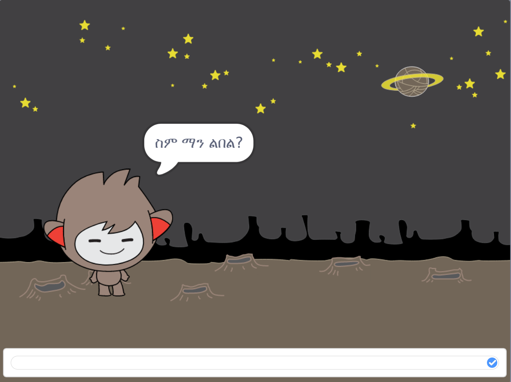
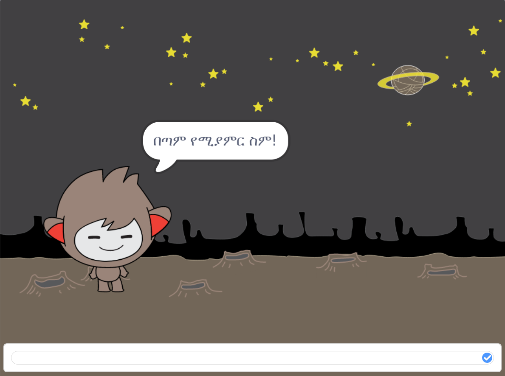
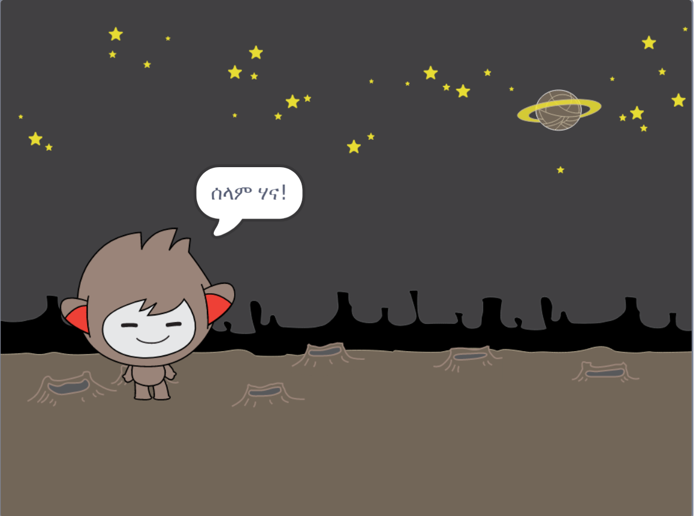

## የሚያወራ የንግግር ሮቦት

አሁን የራሱ ጸባይ ያለው ሮቦት አላችሁ። ቀጥሎ ደግሞ እንዲያወራችሁ ልታደርጉት ነው።

\--- task \---

በእርስዎ chatbot sprite ላይ ጠቅ ያድርጉ, እና ስለዚህም ይህን ኮድ ለማከል `ይህን ጠቅ መቼ`{: class = "block3events"}, ይህም `ስምዎን ይጠይቃል`{: class = "block3sensing"} ከዚያም `"ይላል እንዴት ያለ ቆንጆ ስም! "`{: class = "block3looks"}.


```blocks3
ይህ ስፒት
ጠቅ ሲያደርግ (ስምህ ምንድን ነው?) እና
(2) ሰከንዶች
```

\--- / task \---

\--- ተግባር \---

ኮድዎን ለመሞከር በውይይትዎ ላይ ጠቅ ያድርጉ. የውይይት ሳጥን ስምዎን ሲጠይቁ በደረጃው ከታች ባለው ሳጥን ውስጥ ይተይቡ, ከዚያም ሰማያዊውን ምልክት ጠቅ ያድርጉ ወይም <kbd>አስገባ</kbd>ይጫኑ.





\--- / task \---

\--- ተግባር \---

አሁን የውይይትዎ ስም "እንዴት ደስ የሚል ስም ነው!" በማለት ይመልሳል. መልስ በሚሰጡበት ጊዜ ሁሉ. የውይይቱ መልእክት የበለጠ የግል እንዲሆን ለማድረግ, የተለየ ስም በሚተይበት ጊዜ መልስው የተለያዩ ስለሆነ መልስ መስጠት ይችላሉ.

ወደ chatbot sprite ያለውን ኮድ ለውጥ `መቀላቀል`የ ጋር "ሰላም": {class = "block3operators"} `መልስ`: "? ምን የእርስዎ ስም" ወደ {class = "block3sensing"} ጥያቄ, ስለዚህ ኮድ እንደሚመስለው:


```blocks3
ይህ ስፒት
ጠቅ ሲያደርግ 
 የት እንደሆነ (ስምህ ምንድን ነው?) እና
(2) ሰከንዶች (ሰላምታ (መልስ)) (+) ተቀበል
```



\--- / task \---

\--- ተግባር \---

መልሱን በ **ተለዋዋጭ**በማስቀመጥ በማናቸውም ፕሮጀክትዎ ውስጥ ሊጠቀሙበት ይችላሉ.

`ስም`{: class = "block3variables"} የተባለ አዲስ ተለዋዋጭ ይፈጥራል.

[[[generic-scratch3-add-variable]]]

\--- / task \---

\--- ተግባር \---

አሁን የ `ስም`{: class = "block3variables"} ለ `መልስ`{: class = "block3sensing"} ለውጦችን ለማስቀመጥ የ chatbot sprites ኮድዎን ይቀይሩ:


```blocks3
ይህ ስፒት
ሲጫኑ (ስምዎ ምንድ ነው?) እና

+ ስብስብ [ስም v] ወደ (መልስ)
ይጠብቁ (ሰላምታ (ስም :: ልዩ ልዩ +)) ለ 2 ሰከንዶች
```

የእርስዎ ኮድ ልክ እንደበፊቱ መስራት አለበት: የእርስዎ የሚተዋወቀው ስም ተጠቅመው ለውይይት ያነጋግሩ.


\--- / task \---

ፕሮግራምዎን በድጋሚ ይሞክሩ. የሚተይቡት መልስ በ `ስም`{: class = "block3variables"} ተለዋዋጭ ውስጥ ተስተካክሎ በደረጃው ላይኛው ግራ ጠርዝ ላይ ይታያል. To make it disappear from the Stage, go to the `Variables`{:class="block3variables"} blocks section and click on the box next to `name`{:class="block3variables"} so that it is not marked.