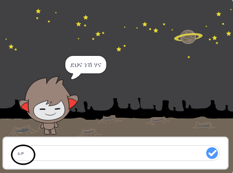
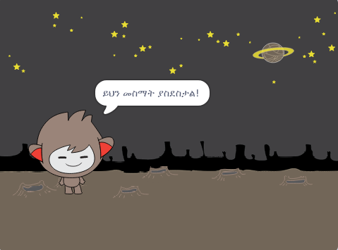
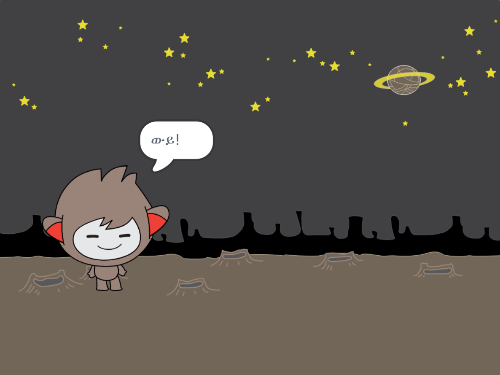
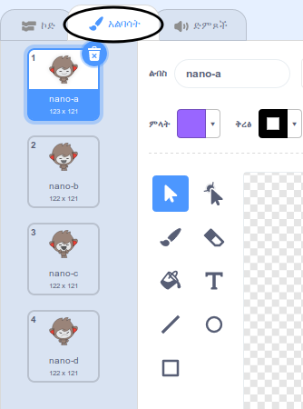
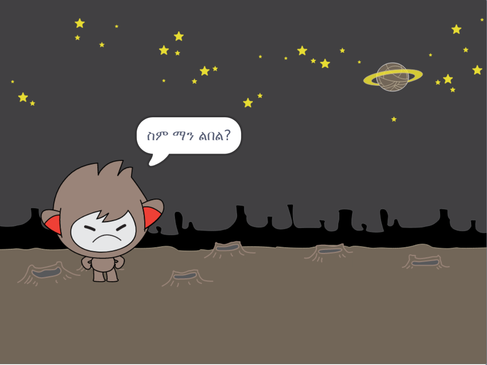
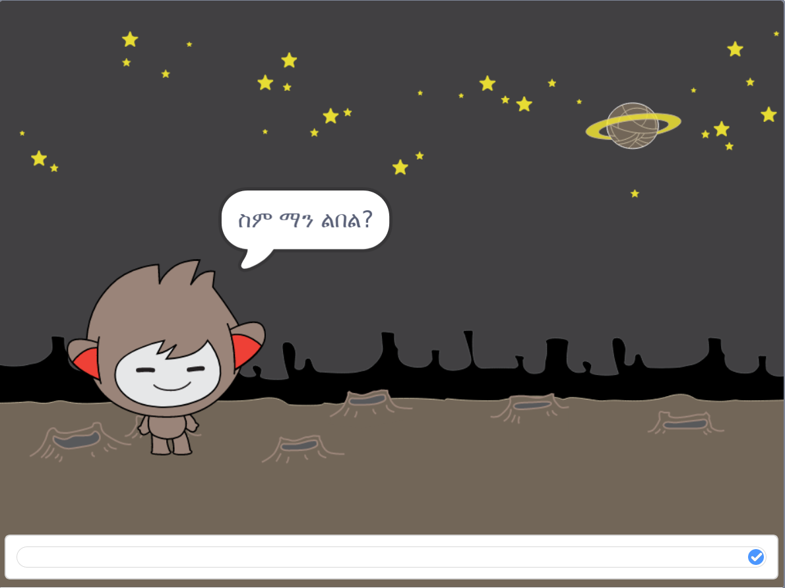

## አማራጮችን መፍጠር

የንግግር ሮቦቱ በሚቀበላቸው መልሶች መሰረት ማድረግ ያለበትን እንዲወስን ፕሮግራም ማድረግ ይቻላል።

በመጀመሪያ የንግግር ሮቦቱ "አዎ" ወይም "አይደለም" የሚል መልስ ያለው ጥያቄን እንዲጠይቅ ታደርጉታላችሁ።.

\--- task \---

የ ንግግር ሮቦቱን ኮድ ቀይሩ። ቻትቦቱ `ስም`{: class = "block3variables"} የሚለውን ተለዋዋጭ በመጠቀም "ደህና ነህ/ሽ ስም" ብሎ መጠየቅ አለበት። ከዚያ «ጥሩ መስማት ጥሩ ነው!» በማለት መመለስ አለበት. `ከሆነ`{: class = "block3control"} የሚቀበለው መልሱ "አዎ" ነው, ነገር ግን መልሱ "የለም" ከሆነ ምንም ይላሉ.






```blocks3
ይህ ስፒት
ጠቅ ሲያደርግ (ስምህ ምንድን ነው?) እና
set [name v] ወደ (መልስ)
ይንገሪያ (ለ (2) ሰከንዶች
+ ይንቁ (ተቀላቅሏል) (ስም)) እና መጠበቅ
; + ከሆነ <(መልስ) = [yes]> ከዚያም 
  [ይህ መስማት ታላቅ ነው!] ይላሉ (2) ሰከንዶች ያህል
መጨረሻ
```

በአግባቡ አዲስ ኮድ ለመፈተን, እሱን ለመፈተን ይገባል **ሁለት ጊዜ**: አንዴ "አዎ", እና አንድ ጊዜ መልስ ጋር "የለም" መልስ ጋር.

\--- / task \---

ለጊዜው, የእርስዎ ውይይት በ "መልስ" መልስ የለውም.

\--- ተግባር \---

የውይይት ኮድንዎን "ኦህ!" በማለት ይመልሱ. ለ "እርስዎ ስም ተስማምተዋል" የሚለው መልስ እንደ ሆነ "አይ" ከሆነ.

የ ተካ `ከሆነ, ከዚያም`አንድ ጋር የማገጃ: {class = "block3control"} `ከሆነ, ታዲያ, ሌላ`{: class = "block3control"} የ chatbot ይችላሉ እንዲሁ የማገጃ, እና ኮድ ይገኙበታል `ይላሉ "ወይኔ!"`{: class = "block3looks"}.


```blocks3
ይህ ስፒት
ጠቅ ሲያደርግ (ስምዎ ምን ማለት ነው?) እና
set [ስም n] ወደ (መልስ)
ይመልሱ (ሰላም) (ስም)) ለ (2) ሰከንዶች
ይጠይቁ (መቀጠል ይችላሉ) ( ስም)) እና መጠበቅ

; + ከሆነ <(መልስ) = [yes]> ከዚያም 
  [ይህ መስማት ታላቅ ነው!] ይላሉ (2) ሰከንዶች ያህል
ሌላ 
+ [ወይኔ!] (2) ሰከንዶች ያህል እላለሁ
መጨረሻ
```

\--- / task \---

\--- ተግባር \---

ኮድዎን ይፈትሹ. «አይ» ብለው ሲመልሱ እና «አዎ» ብለው ሲመልሱ የተለየ ምላሽ ማግኘት አለብዎት: የእርስዎ ውይይትቦት «መስማት ጥሩ ነው!» የሚል ምላሽ መስጠት አለበት. መልስዎ "አዎ" (መልከፊደል ትብ አይደለም) ብለው መልስ ሲሰጡ, እና "በ« አይ! **ሌላ ነገር**.




\--- / task \---

ቻትህ ማውራት እንዲችል ለማንኛውም ኮድ በ `, ሌላ`{: class = "block3control"} ማገድ ትችላለህ.

የእርስዎን የ chatbot **ድራማዎች** ትር ጠቅ ካደረጉት ከአንድ ልብስ በላይ መኖሩን ያያሉ.



\--- ተግባር \---

መልስዎ በሚተይቡበት ወቅት የውይይት መቁጠሪያ ልብሶችን ለመቀየር የውይይት ኮድንዎን ይቀይሩ.


በ `ውስጥ ያለውን ኮድ ይቀይሩ, ከዚያ, ሌላ`{: class = "block3control"} ከ `መቀየር መቀየር`{: class = "block3looks"}.


```blocks3
ይህ ስፒት
ጠቅ ሲያደርግ (ስምዎ ምን ማለት ነው?) እና
set [ስም n] ወደ (መልስ)
ይመልሱ (ሰላም) (ስም)) ለ (2) ሰከንዶች
ይጠይቁ (መቀጠል ይችላሉ) ( ስም)) እና መጠበቅ
ከሆነ <(መልስ) = [yes]> ከዚያም 

; + (ናኖ-ሐ v) ወደ የሚኖሩት መቀየር
  (2) ሰከንዶች [ይህ መስማት ታላቅ ነው!] ይላሉ
ሌላ 
nano- (+ ጋር የሚኖሩት ይቀይሩ d v)
  ለ (2) ሰከንዶች
ይል ይበሉ
```

ኮድዎን ይፈትሹ እና ያስቀምጡ. የርስዎ የውይይት ክፍል እንደ መልስዎ ይለወጣል.

\--- / task \---

ያንተ የቃላት ምርጫ ልብስ ከተለወጠ በኋላ እንደዛው ይቆያል እና ከመጀመሪያው ወደነበረበት አይመለስም.

ይሄንን መሞከር ይችላሉ: ኮድዎን ያሂዱ እና «አይ» የሚል መልስ ያድርጉት, የቻትቦዎ ፊት ለ ደስ የማያላት መልክ ይቀየራል. በመቀጠል የእርስዎን ኮድ እንደገና ያሂዱ እና ስምዎን ከመጠየቁ በፊት የውይይት መመለሻዎ ወደ ኋላ እንዳይመለስ ያስተውሉ.



\--- ተግባር \---

ይህን ችግር ለማስተካከል, ወደ chatbot ያለውን ኮድ መጨመር `መቀየሪያ የሚኖሩት`{: class = "block3looks"} ሲጀምር `ወደ sprite ጠቅ ሲደረግ`{: class = "block3events"}.


```blocks3
ይህ ስፒል

ለውጦችን ወደ (ናኖ-ቪ)
ሲጫኑ 
 ይጠይቁ [የእርስዎ ስም ምንድን ነው?] እና ይጠብቁ
```



\--- / task \---