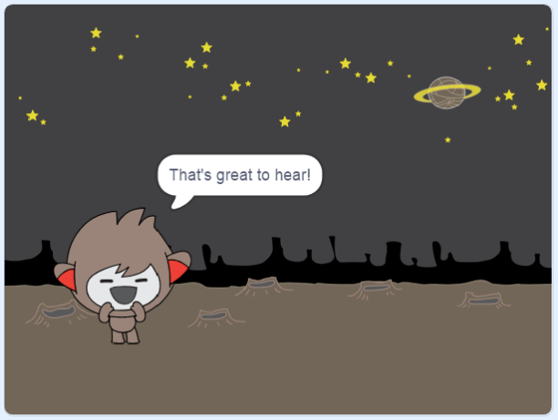

## አማራጮችን መፍጠር

የንግግር ሮቦቱ በሚቀበላቸው መልሶች መሰረት ማድረግ ያለበትን እንዲወስን ፕሮግራም ማድረግ ይቻላል።

በመጀመሪያ የንግግር ሮቦቱ "አዎ" ወይም "አይደለም" የሚል መልስ ያለው ጥያቄን እንዲጠይቅ ታደርጉታላችሁ።.

\--- task \---

የ ንግግር ሮቦቱን ኮድ ቀይሩ። ቻትቦቱ `ስም`{: class = "block3variables"} የሚለውን ተለዋዋጭ በመጠቀም "ደህና ነህ/ሽ ስም" ብሎ መጠየቅ አለበት። ከዚያ የሚቀበለው መልስ "አዎ" `ከሆነ`{: class = "block3control"} "ይህን መስማት ያስደስታል!" በማለት መመለስ አለበት። መልሱ "አይ" ከሆነ ግን ምንም አይመልስም።


```blocks3
ይህ ስፕራይት ሲነካ
[ስም ማን ልበል?] ጠይቅና ጠብቅ
[ስም v] ወደ (መልስ) ለውጥ
(አገናኝ [ሰላም] (ስም) ) ን በል ለ (2) ሰከንዶች
(አገናኝ [ደህና ነህ/ሽ] (ስም) ) ጠይቅና ጠብቅ
+ <(መልስ) = [አዎ]> ከሆነ
  [ይህን መስማት ያስደስታል] ን በል ለ (2) ሰከንዶች
end
```

ኮዱን በትክክል ለመፈተን **ሁለት ጊዜ** መሞከር ይገባል፤ አንድ ጊዜ "አዎ" እና አንድ ጊዜ ደግሞ "አይ" ከሚል መልስ ጋር።

\--- / task \---

ለጊዜው የንግግር ሮቦቱ "አይ" ለሚለው መልስ ምንም ምላሽ የለውም።

\--- task \---

የንግግር ሮቦቱ "ደህና ነህ/ሽ" የሚለው መልስ ጥያቄ መልስ "አይ" ከሆነ "ውይ!" በማለት እንዲመልስ ኮዱን ቀይሩ።

`ከሆነ`{class = "block3control"} የሚለውን ክፍል `ከሆነ ካልሆነ`{: class = "block3control"} በሚለው ተኩትና ከዚያም ሮቦቱ `"ውይ!"`{: class = "block3looks"} እንዲል ኮድ ጨምሩበት።


```blocks3
ይህ ስፕራይት ሲነካ
[ስም ማን ልበል?] ጠይቅና ጠብቅ
[ስም v] ወደ (መልስ) ለውጥ
(አገናኝ [ሰላም ] (ስም) ) ን በል ለ (2) ሰከንዶች
(አገናኝ [ደህና ነህ/ሽ] (ስም) ) ጠይቅና ጠብቅ
+ <(መልስ) = [አዎ]> ከሆነ
  [ይህን መስማት ያስደስታል] ን በል ለ (2) ሰከንዶች
ካልሆነ 
+ [ውይ!] ን በል ለ (2) ሰከንዶች
end
```

\--- / task \---

\--- task \---

ኮዳችሁን ፈትሹ። "አይ" እና "አዎ" ብላችሁ ስትመልሱ የተለየ ምላሽ ማግኘት አለባችሁ። የንግግር ሮቦቱ "አዎ" ስትሉት "ይህን መስማት ያስደስታል!" ማለት አለበት እና **ሌላ ነገር** ካላችሁት ደግሞ "ውይ!" ብሎ መመለስ አለበት።


\--- / task \---

`ከሆነ ካልሆነ`{:class="block3control"} በሚለው ክፍል ውስጥ ቻትቦቱ እንዲናገር ብቻ ሳይሆን ሌላ ማንኛውንም ኮድ መክተት ትችላላችሁ!

የቻትቦቱ **አልባሳት** ላይ ጠቅ ካደረጋችሁ ከአንድ ልብስ በላይ እንዳለ ታያላችሁ።


\--- task \---

መልሳችሁን በምትጽፉበት ጊዜ ቻትቦቱ ልብሱን እንዲቀይር ኮዱን አስተካክሉት።




`ከሆነ ካልሆነ`{: class = "block3control"} በሚለው ክፍል ውስጥ ያለውን ኮድ `ልብስ ቀይር`{: class = "block3looks"} በሚለው ተኩት።


```blocks3
ይህ ስፕራይት ሲነካ
[ስም ማን ልበል?] ጠይቅና ጠብቅ
[ስም v] ወደ (መልስ) ለውጥ
(አገናኝ [ሰላም ] (ስም) ) ን በል ለ (2) ሰከንዶች
(አገናኝ [ደህና ነህ/ሽ] (ስም) ) ጠይቅና ጠብቅ
+ <(መልስ) = [አዎ]> ከሆነ 
+ ልብስ ወደ (nano-c v) ለውጥ
   [ይህን መስማት ያስደስታል] ን በል ለ (2) ሰከንዶች
ካልሆነ 
+ ልብስ ወደ (nano-d v) ለውጥ
  [ውይ!] ን በል ለ (2) ሰከንዶች
end
```

ኮዱን ፈትሹና አስቀምጡ። የንግግር ሮቦቱ ፊት እንደ መልሳችሁ አይነት ይለዋወጣል።

\--- / task \---

የንግግር ሮቦቱ ልብስ አንዴ ከተቀየረ በሁዋላ እንደዛው እንደሚቀር እናም ወደ መጀመሪያው እንደማይመለስ አስተዋላችሁ?

እስኪ ይህን ሞክሩ: ኮዱን አስጀምሩትና "አይ" ብላችሁ መልሱ፤ የቻትቦቱ ፊት ያዘነ ገጽታ ይኖረዋል። በመቀጠል ኮዱን እንደገና አስጀምሩት እና ስማችሁን ከመጠየቁ በፊት የ ቻትቦቱ ፊት ወደ በፊቱ ደስተኛ መልክ እንዳልተመለሰ አስተውሉ።


\--- task \---

ይህን ችግር ለማስተካከል ኮዱ መጀመሪያ ላይ `ይህ ስፕራይት ሲነካ`{: class = "block3events"} `ልብስ ለውጥ`{: class = "block3looks"} የሚለውን ጨምሩበት።


```blocks3
ይህ ስፒል

ለውጦችን ወደ (ናኖ-ቪ)
ሲጫኑ 
 ይጠይቁ [የእርስዎ ስም ምንድን ነው?] እና ይጠብቁ
```


\--- / task \---