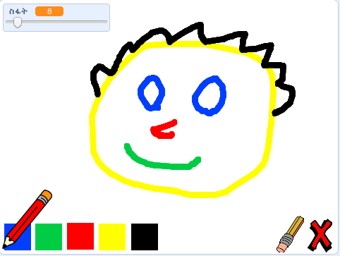

## ቀጣዩ ምንድነው?

የ [ቀለም ሳጥን](https://projects.raspberrypi.org/en/projects/paint-box?utm_source=pathway&utm_medium=whatnext&utm_campaign=projects)ን ፕሮጀክትን ሞክሩት። የራሳችሁን የስእል መሳያ ፕሮግራም መፍጠር ትችላላችሁ!

ለመጀመር አረንጉዋዴውን ባንዲራ ተጫኑት። እርሳሱን ለማንቀሳቀስ ማውሱን ተጠቀሙ ፣ እና ለመሳል የግራ ማውስ ቁልፍ ተጭናችሁ ያዙ። እርሳስ ለመቀየር አንድ ቀለም ላይ ጠቅ አድርጉ። ወደ ላጲስ ለመቀየር እና የሰራችሁትን ለማጥፋት ላጲሱ ላይ ጠቅ አድርጉ። ገጹን ለማጽዳት X መልክቱን ተጫኑ።

  <iframe allowtransparency="true" width="485" height="402" src="//scratch.mit.edu/projects/embed/267243161/?autostart=false" frameborder="0" scrolling="no"></iframe>
  

--- /no-print ---

--- print-only --- ለመጀመር አረንጓዴ ባንዲራ ላይ ጠቅ ታደርጋላችሁ ፤ እርሳሱን ለማንቀሳቀስ ማውሱን ትጠቀማላችሁ እና ለመሳል ደግሞ የማውሱን የግራ ቁልፍ ተጭናችሁ ትይዛላችሁ።፡ አንድን ቀለም(ከለር) መንካት የእርሳሱን ቀለም ይቀይረዋል፤ ላጲሱን መንካት ደግሞ ወደ ላጲሱ ይቀይረዋል!

 --- /print-only ---
