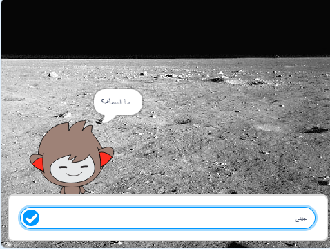

--- no-print ---

هذا هو إصدار **Scratch 3** من المشروع. هناك أيضًا [إصدار Scratch 2 للمشروع](https://projects.raspberrypi.org/ar-SA/projects/chatbot-scratch2).

--- /no-print ---

## المقدمة

سوف تتعلم كيفية برمجة شخصية يمكنها التحدث معك! تسمى هذه الشخصية روبوت الدردشة او Chatbot.

### ما الذي ستصنعه

--- no-print ---

انقر على العلم الاخضر، ثم انقر على شخصية روبوت الدردشة لبدء المحادثة. عندما يسأل روبوت الدردشة سؤالاً، اكتب اجابتك في المربع الموجود اسفل المنصة، ومن ثم انقر على العلامة الزرقاء في اليمين (أو اضغط على `Enter`) لترى جواب الروبوت.

  <iframe allowtransparency="true" width="485" height="402" src="https://scratch.mit.edu/projects/embed/357856279/?autostart=false" 
  frameborder="0" scrolling="no"></iframe>

--- /no-print ---

--- print-only ---

--- /print-only ---

--- collapse ---
---
title: ما ستحتاج إليه
---

### الأجهزة

- جهاز كمبيوتر يدعم تشغيل برنامج Scratch 3

### البرامج

- برنامج Scratch 3 (سواء أكان [عبر الإنترنت](https://rpf.io/scratchon) أو [دون اتصال بالإنترنت](https://rpf.io/scratchoff))

### للتحميل

- [ابحث عن الملفات لتحميلها هنا](http://rpf.io/p/ar-SA/chatbot-go).

--- /collapse ---

--- collapse ---
---
title: ما الذي ستتعلمه
---

- استخدام البرمجة لتنسيق جملة في السكراتش (Scratch)
- تعرف أن من الممكن استخدام المتغيرات لخزن مدخلات المستخدم
- استخدام الاختيار المشروط للرد على مدخلات المستخدم في السكراتش (Scratch)
--- /collapse ---

--- collapse ---
---
title: ملاحظات إضافية للمعلمين
---

--- no-print ---

اذا كنت ترغب بطباعة هذا المشروع، الرجاء استخدام [نسخة سهلة الطباعة](https://projects.raspberrypi.org/ar-SA/projects/chatbot/print){:target="_blank"}.

--- /no-print ---

يمكنك ايجاد [المشروع كامل هنا](http://rpf.io/p/ar-SA/chatbot-get).

--- /collapse ---