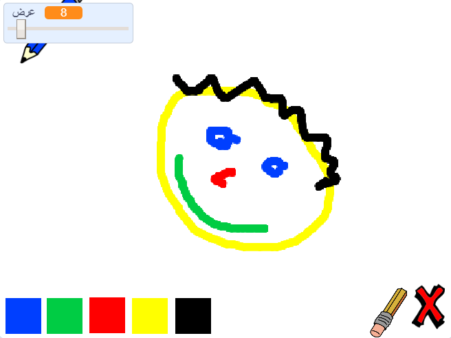

## ما التالي؟

جرب أن تطبق مشروع [علبة الالوان](https://projects.raspberrypi.org/ar-SA/projects/paint-box?utm_source=pathway&utm_medium=whatnext&utm_campaign=projects)، حيث ستقوم بانشاء برنامج الرسم الخاص بك!

--- no-print --- انقر على العلم الأخضر للبدء. استخدم الماوس لتحريك قلم الرصاص واضغط باستمرار على زر الماوس الأيسر لترسم. انقر على لون لتغيير أقلام الرصاص. انقر على الممحاة لتفعيل استخدامها، واستخدمها لمحو عملك. لمسح الصفحة بالكامل، انقر فوق رمز التقاطع (علامة الاكس).

  <iframe allowtransparency="true" width="485" height="402" src="//scratch.mit.edu/projects/embed/267243161/?autostart=false" frameborder="0" scrolling="no"></iframe>
  

--- /no-print ---

--- print-only --- سوف تنقر على العلم الأخضر للبدء، و ستستخدم الماوس لتحريك قلم الرصاص و ستنقر مع الاستمرار بالضغط على زر الماوس الأيسر لترسم. النقر على لون سيغير لون قلم الرصاص، و النقر على أداة الممحاة سوف يجعل الممحاة تبدأ العمل!

 --- /print-only ---

***
تمت ترجمة هذا المشروع بواسطة متطوعين:

نادية علي قاسم

وفاء علي

محمد عبدالخالق المحفدي

عبدالعزيز عبدالله الفائز

ريان علي الحمود

Mohamed Rayyan

بفضل المتطوعين ، يمكننا إعطاء الناس في جميع أنحاء العالم فرصة للتعلم بلغتهم الخاصة. يمكنك مساعدتنا في الوصول إلى المزيد من الأشخاص من خلال التطوع للترجمة - مزيد من المعلومات على [rpf.io/translate](https://rpf.io/translate).
