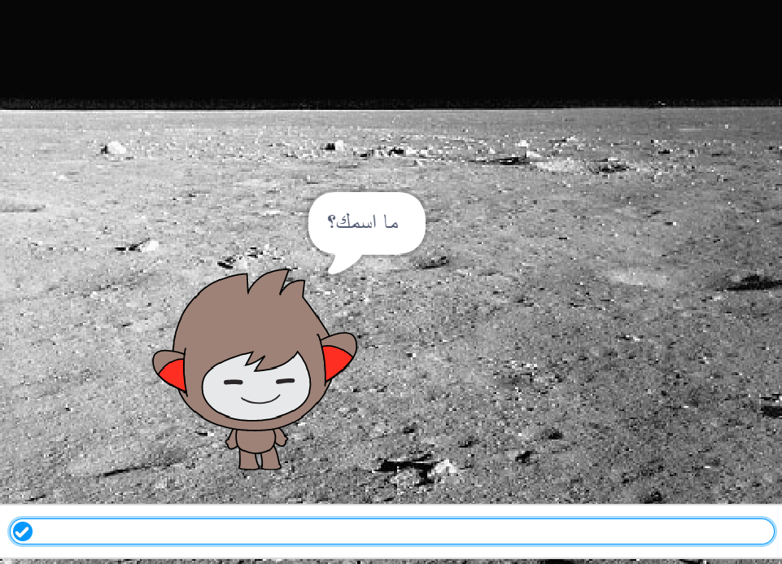
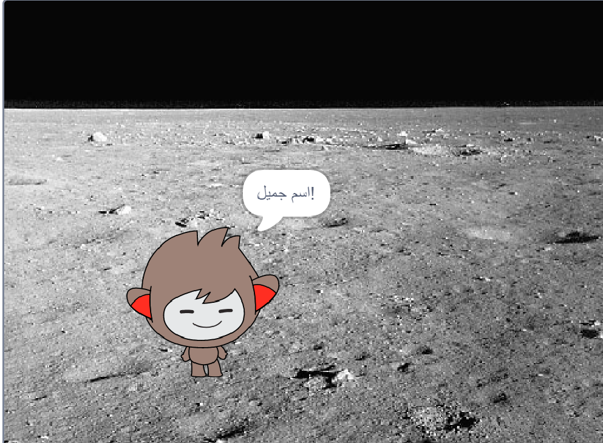
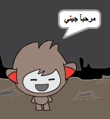

## روبوت مُحاوِر

الآن، بعد أن أصبح لديك روبوت بشخصية معينة، ستقوم ببرمجته ليتحدث معك.

\--- task \---

أنقر على روبوت الدردشة الخاص بك وأضف هذه التعليمة البرمجية `عند النقر على هذا الكائن` {:class="block3events"}, حتى`يسال عن إسمك`{:class="block3sensing"} وبعدها `بقول "يا له من إسم جميل!"`{:class="block3looks"}.


```blocks3
عند النقر على هذا الكائن
إسال [ما أسمك؟] وانتظر
قل[يا له من اسم جميل!] لمدة (2) ثانية
```

\---/task--

\--- task \---

إضغط على روبوت الدردشة الخاص بك واختبره. عندما يسألك الروبوت عن اسمك، اطبع اسمك في الصندوق الذي يطهر باسفل المسرح، ثم اضغط على العلامة الزرقاء أو اضغط على <kbd>Enter</kbd>.





\---/task\---

\--- task \---

الان، يرد عليك الروبوت "يا له من اسم جميل!" في كل مرة تجيبه. يمكنك أن تجعل الروبوت يجيب بصورة اكثر شخصية، بحيث تكون الاجابة مختلفة في كل مرة يتم فيها كتابة اسم مختلف.

Change the chatbot sprite’s code to `join`{:class="block3operators"} "Hi" with the `answer`{:class="block3sensing"} to the "What's your name?" question, so that the code looks like this:


```blocks3
when this sprite clicked
ask [What's your name?] and wait
say (join [Hi ] (answer) :: +) for (2) seconds
```



\--- /task \---

\--- task \---

By storing the answer in a **variable**, you can use it anywhere your project.

Create a new variable called `name`{:class="block3variables"}.

[[[generic-scratch3-add-variable]]]

\--- /task \---

\--- task \---

Now, change your chatbot sprites’s code to set the `name`{:class="block3variables"} variable to `answer`{:class="block3sensing"}:


```blocks3
when this sprite clicked
ask [What's your name?] and wait

+ set [name v] to (answer)
say (join [Hi ] (name :: variables +)) for (2) seconds
```

Your code should work as before: your chatbot should say hi using the name you type in.


\--- /task \---

Test your program again. Notice that the answer you type in is stored in the `name`{:class="block3variables"} variable, and is also shown in the top left-hand corner of the Stage. To make it disappear from the Stage, go to the `Data`{:class="block3variables"} blocks section and click on the box next to `name`{:class="block3variables"} so that it is not marked.