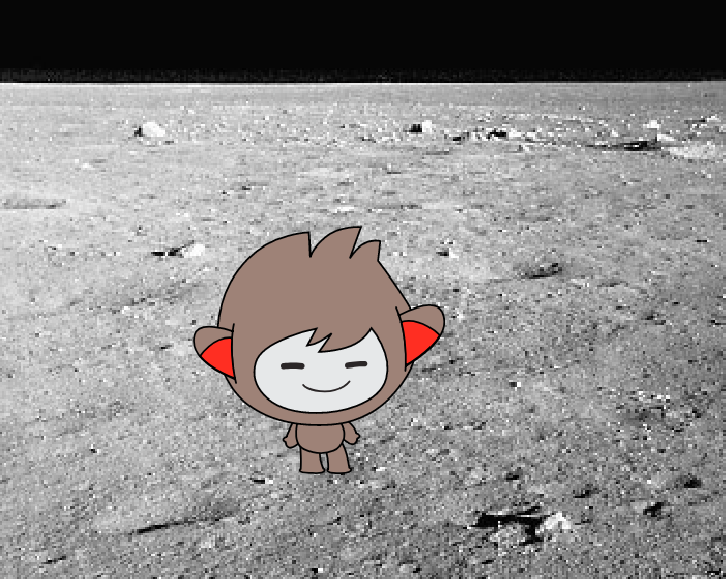

## روبوتك

--- task ---

قبل أن تبدأ في إنشاء روبوتك، يجب أن تحدِّد شخصيته، **فكِّر في الأسئلة التالية**:

    ما اسمه؟
    أين يعيش؟
    هل هو سعيد؟ جاد؟ مرح؟ خجول؟ ودود؟
    

--- /task ---

--- task ---

افتح مشروع فارغ جديد في Scratch.

[[[generic-scratch-new-project]]]

--- /task ---

--- task ---

اختر واحدًا من كائنات الشخصيات هذه، ثم أضِفه إلى مشروعك:

[[[generic-scratch-sprite-from-library]]]

--- /task ---

--- task ---

اختر خلفية تتناسب مع شخصية روبوتك، إليك مثالًا للخلفية، وليس شرطًا أن تكون خلفيتك كتلك الموضحة في المثال:

[[[generic-scratch-backdrop-from-library]]]

--- /task ---

--- task ---

احفظ مشروعك.

[[[generic-scratch-saving]]]

--- /task ---