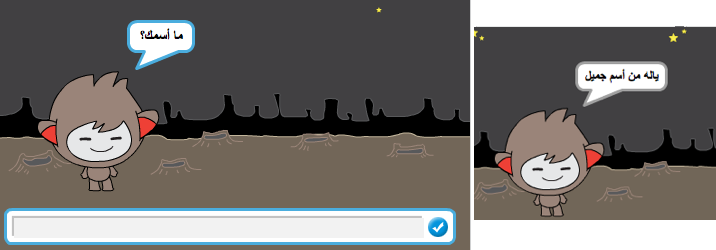
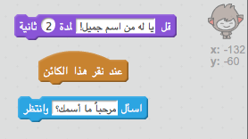
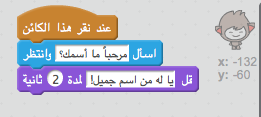
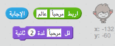
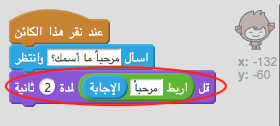
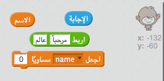
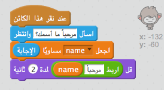
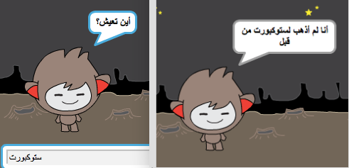

## روبوت مُحاوِر

الآن، بعد أن أصبح لديك روبوت بشخصية معينة، لنُبرمجْه ليتحدث معك.

--- task ---

أضف تعليمة برمجية لروبوتك بحيث عندما تنقر عليه، يسألك عن اسمك ثم يقول "ياله من اسم جميل!"

--- hints --- --- hint --- **عند النقر على كائن الروبوت**، يجب أن **يسألك** الروبوت عن اسمك. ثم يجب أن **يقول** "ياله من اسم جميل!" --- /hint --- --- hint --- فيما يلي قوالب التعليمات البرمجية التي ستحتاج إليها:  --- /hint --- --- hint --- جب أن تكون التعليمة البرمجية التي تُدخلها كما يلي:  --- /hint --- --- /hints ---

--- /task ---

--- task ---

الأن الروبوت بكل بساطة يُجيب بعبارة "ياله من اسم جميل!" في كل مرة. هل يمكنك تخصيص إجابة روبوتك وتجعله يستفيد من إجابتك؟

--- hints --- --- hint --- **عند النقر على كائن الروبوت**، يجب أن **يسألك** الروبوت عن اسمك. ثم يجب أن **يقول** "مرحباً" يليها **إجابتك**. --- /hint --- --- hint --- فيما يلي التعليمات البرمجية التي ستحتاج إليها:  --- /hint --- --- hint --- هكذا يجب أن تكون التعليمة البرمجية التي تُدخلها:  --- /hint --- --- /hints ---

--- /task ---

--- task ---

إذا خزَّنتَ إجابتك في **متغير**، فسيمكنك استخدامها لاحقًا، أنشئ متغيرًا جديدًا يُسمى `الاسم` لتخزين اسمك.

[[[generic-scratch-add-variable]]]

--- /task ---

--- task ---

هل يمكنك تخزين إجابتك في المتغير `الاسم` واستخدام هذا المتغير في إجابة الروبوت؟

يجب أن تعمل التعليمة البرمجية التي تُدخلها كما سبق: يجب أن يقول الروبوت مرحبًا، يليها اسمك.

--- hints --- --- hint --- **عند النقر على كائن الروبوت**، يجب أن **يسألك** الروبوت عن اسمك. يجب أن **تعيِّن** المتغير `الاسم` إلى **إجابتك**. عندئذٍ يجب أن **يقول** الروبوت "مرحبًا"، يليها **اسمك**. --- /hint --- --- hint --- فيما يلي التعليمات البرمجية التي ستحتاج إليها:  --- /hint --- --- hint --- هكذا يجب أن تكون التعليمة البرمجية التي تُدخلها:  --- /hint --- --- /hints ---

--- /task ---

--- challenge ---

## التحدي: مزيد من الأسئلة

برمِج روبوتك ليسأل سؤالًا آخر، هل يمكنك تخزين إجابتك في متغير جديد؟

 --- /challenge ---