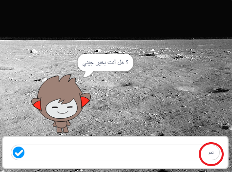
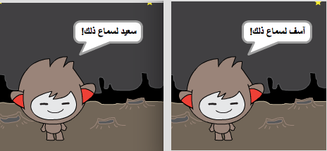
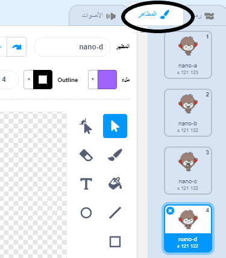
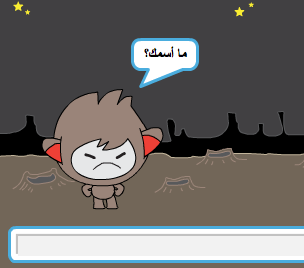
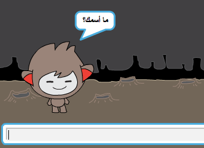

## اتخاذ القرارات

يمكنك برمجة روبوتك ليقرِّر ما سيقوله أو سيفعله بناءً على إجاباتك عن أسئلته.

أولاً ، ستجعل روبوتك يطرح سؤالاً يمكن الإجابة عليه بـ" نعم "أو" لا".

--- task ---

تغيير رمز روبوتك. يجب أن يقوم روبوت الدردشة بطرح السؤال "هل أنت موافق الاسم؟" ، وذلك باستخدام متغير `الاسم`{:class="block3variables"}. ثم يجب أن يجيب" شيء رائع أسمعه!" `إذا`{:class="block3control"} كان الجواب الذي تتلقاه هو "نعم"، ولكن لا تقل شيئًا إذا كانت الإجابة" لا".




```blocks3
عند نقر هذا الكائن
اسأل ["ما أسمك؟"] وانتظر
اجعل [الاسم v] مساويًا (الإجابة)
قل (اربط [مرحبا] (الاسم)) لمدة (2) ثانية
+اسأل (اربط [هل انت بخير ] (اربط)) وانتظر
+إذا <(الإجابة) = [نعم]>
قل [شيء رائع أسمعه!] لمدة (2) ثانية
```

لاختبار التعليمة البرمجية الجديدة كما ينبغي، يجب أن تختبرها **مرتين**، بحيث تكون إجابتك في الاختبار الأول هي "نعم"، وتكون إجابتك في الاختبار الثاني هي" لا".
 
--- /task ---

في الوقت الحالي ، لا يقول روبوتك أي شيء عند الاجابة بـ" لا".

--- task ---

غير التعليمة البرمجية للروبوت بحيث يرد" أوه لا! "إذا تلقى" لا "كإجابة على" هل أنت موافق".

استبدال كتلة البرمجة `إذا ، ثم`{:class="block3control"} بكتلة برمجية تحتوي على `إذا ، ثم ، غيره`{:class="block3control"}، وقم بتضمين رمز حتى يتمكن الروبوت من `أن يقول "أوه لا!"`{:class="block3looks"}.


```blocks3
عند نقر هذا الكائن
اسأل ["ما أسمك؟"] وانتظر
اجعل [الاسم v] مساويًا (الإجابة)
قل (اربط [مرحبا] (الاسم)) لمدة (2) ثانية
اسأل (اربط [هل انت بخير] (الاسم)) وانتظر
+إذا <(الإجابة) = [نعم]>
قل [شيء رائع أسمعه!] لمدة (2) ثانية
غيره
+ قل [أو لا!] لمدة (2) ثانية
end
```

--- /task ---

--- task ---

اختبر مشروعك. يجب أن تحصل على استجابة مختلفة عندما تجيب بـ "لا" وعندما تجيب بـ "نعم": فإن روبوتك يجب أن يجيب بـ "شيء رائع أسمعه!" عندما تجيب بـ "نعم" (وهي ليست حساسة لحالة الأحرف)، والرد بـ "أوه لا!" عند الإجابة يـ** أي شيء آخر**.




--- /task ---

يمكنك إدخال أي تعليمة برمجية في قالب `اذا/ثم`{:class="block3control"}، ولا تقتصر على جعل روبوتك يتكلم فحسب!

إذا نقرتَ على علامة التبويب **المظاهر** الخاصة بالروبوت، فسترى أكثر من مظهر واحد له.



--- task ---

تغيير التعليمات البرمجية الخاص بك بحيث يتغير مظهر الروبوت عند كتابة إجابتك.


قم بتغيير التعليمات البرمجية داخل كتلة `إذا ، ثم ، غيره`{:class="block3control"} إلى `تبديل المظهر`{:class="block3looks"}.


```blocks3
عند نقر هذا الكائن
اسأل ["ما أسمك؟"] وانتظر
اجعل [الاسم v] مساويًا (الإجابة)
قل (اربط [مرحبا] (الاسم)) لمدة (2) ثانية
اسأل (اربط [هل انت بخير] (الاسم)) وانتظر
إذا <(الإجابة) = [نعم]>
+غيِّر المظهر إلى (nano-c v)
  قل [شيء رائع أسمعه!] لمدة (2) ثانية
وإلا
+غيِّر المظهر إلى (nano-d v)
  قل [أو لا!] لمدة (2) ثانية
انتهاء
```

اختبر مشروعك وقم بحفظه. يجب أن ترى أن تعابير وجه الروبوت تتغير حسب إجابتك.

--- /task ---

هل لاحظت أنه بعد تغيير زي الروبوت الخاص بك، يظل هكذا ولا يتغير إلى ما كان عليه في البداية؟

يمكنك تجربة ذلك: قم بتشغيل التعليمات البرمجية وأحب بـ"لا" بحيث يتغير وجه الروبوت إلى مظهر غير سعيد. ثم قم بتشغيل الشفرة مرة أخرى ولاحظ أن الروبوت لا يتغير مرة أخرى ليبدو سعيدًا قبل أن يسأل اسمك.



--- task ---

لإصلاح هذه المشكلة، أضف التعليمة البرمجية `تبديل الزي`{:class="block3looks"} في البداية بعد `عند النقر فوق العفريت`{:class="block3events"}.


```blocks3
عند نقر هذا الكائن
+غيِّر المظهر إلى (nano-a v)
اسأل [ماهو اسمك؟] وانتظر
```



--- /task ---