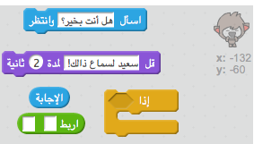
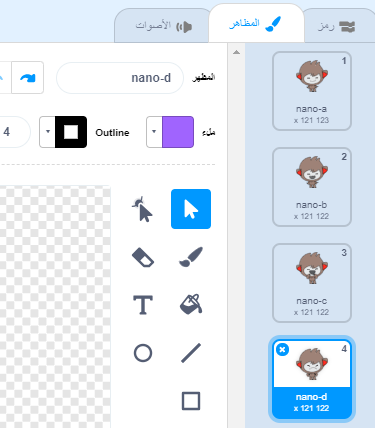
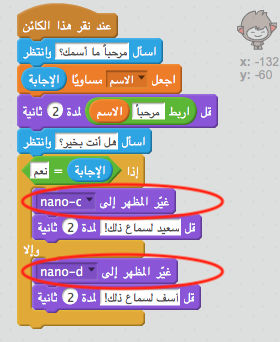

## اتخاذ القرارات

يمكنك برمجة روبوتك ليقرِّر ما سيقوله أو سيفعله بناءً على إجاباتك عن أسئلته.

--- task ---

هل يمكنك أن تجعل الروبوت يسأل السؤال "هل أنت بخير؟"، وتُبرمجه بحيث يكون ردُّه على المستخدم هو "سعيد لسماع ذلك!" فقط **إذا** كانت إجابة المستخدم عن السؤال هي "نعم"؟

لاختبار التعليمة البرمجية الجديدة كما ينبغي، يجب أن تختبرها **مرتين**، بحيث تكون إجابتك في الاختبار الأول هي "نعم"، وتكون إجابتك في الاختبار الثاني هي "لا".

يجب أن يكون رد الروبوت هو "سعيد لسماع ذلك!" إذا كانت إجابتك هي "نعم"، ولا يرد بأي شيء إذا كانت إجابتك هي "لا".

--- hints --- --- hint --- بعد أن قال الروبوت "مرحبًا"، يجب أن **يسأل** أيضًا "هل أنت بخير؟". **إذا** كانت إجابتك هي "نعم"، فيجب أن ي**قول** الروبوت "سعيد لسماع ذلك!". --- /hint --- --- hint --- فيما يلي التعليمات البرمجية التي ستحتاج إليها:  --- /hint --- --- hint --- هكذا يجب أن تكون التعليمة البرمجية التي تُدخلها:  --- /hint --- --- /hints ---

--- /task ---

--- task ---

حاليًا، لا يقول روبوتك أي شيء عندما تكون إجابتك هي "لا"، هل يمكنك تغيير ذلك بحيث يكون رد الروبوت هو "آسف لسماع ذلك!" إذا كانت إجابتك عن سؤاله هي "لا"؟

اختبر مشروعك وقم بحفظه. الأن يجب أن يقول روبوتك "آسف لسماع ذلك!" إذا كانت إجابتك هي "لا". في الواقع، سيقول الروبوت "آسف لسماع ذلك!" إذا أجبتَ بأي شيء بخلاف "نعم" (فكلمة **وإلا** في التعليمات البرمجية `if/else` تعني **خلاف ذلك**).

--- hints --- --- hint --- يجب أن يقول روبوتك الآن "سعيد لسماع ذلك!" **إذا** كانت إجابتك هي "نعم"، ولكن يجب أن يقول "آسف لسماع ذلك!" إذا كانت إجابتك شيئًا آخر، أيْ **وإلا**. --- /hint --- --- hint --- فيما يلي التعليمات البرمجية التي ستحتاج إلى استخدامها:  --- /hint --- --- hint --- هكذا يجب أن تكون التعليمة البرمجية التي تُدخلها:  --- /hint --- --- /hints ---

--- /task ---

--- task ---

يمكنك إدخال أي تعليمة برمجية في قالب `if/else`، لا مجرد الاقتصار على تعليمة برمجية تجعل روبوتك يتكلم فحسب. إذا نقرتَ على علامة التبويب **المظهر** الخاصة بالروبوت، فسترى أكثر من مظهر واحد له.

--- /task ---

--- task ---

هل يمكنك تغيير مظهر الروبوت بحيث يتناسب مع الإجابة التي تُدخلها؟

اختبر مشروعك وقم بحفظه. يجب أن ترى أن تعابير وجه الروبوت تتغير حسب إجابتك.

--- hints --- --- hint --- الروبوتك الأن يجب أن **يتغير مظهر** حسب الإجابة المُدخلة. --- /hint --- --- hint --- فيما يلي التعليمات البرمجية التي ستحتاج إلى استخدامها:  --- /hint --- --- hint --- يجب أن تكون التعليمة البرمجية التي تُدخلها كما يلي:  --- /hint --- --- /hints ---

--- /task ---

--- task ---

هل لاحظتَ أن مظهر الروبوت يظل بالشكل نفسه الذي تغير إليه في آخر مرة تحدثتَ معه؟ هل يمكنك إصلاح هذه المشكلة؟

اختبر مشروعك وقم بحفظه: شغِّل التعليمة البرمجية واكتب "لا"، لكي يبدو الروبوت حزينًا. عندما تشغِّل التعليمة البرمجية مرة أخرى، يجب أن يتغير وجه الروبوت ليصبح مبتسمًا كما كان قبل أن يسألك عن اسمك.

--- hints --- --- hint --- **عند النقر على الكائن**، يجب أولًا أن **يتغير مظهر** الروبوت ليصبح وجهه مبتسمًا. --- /hint --- --- hint --- فيما يلي التعليمات البرمجية التي ستحتاج إلى استخدامها:  --- /hint --- --- hint --- يجب أن تكون التعليمة البرمجية التي تُدخلها كما يلي:  --- /hint --- --- /hints ---

--- /task ---

--- challenge ---

## التحدي: مزيد من القرارات

برمِج روبوتك ليسأل سؤالًا آخر - يُجاب عنه بـ "نعم" أو"لا". هل يمكنك أن تجعل الروبوت يتجاوب مع الإجابة؟

 --- /challenge ---
