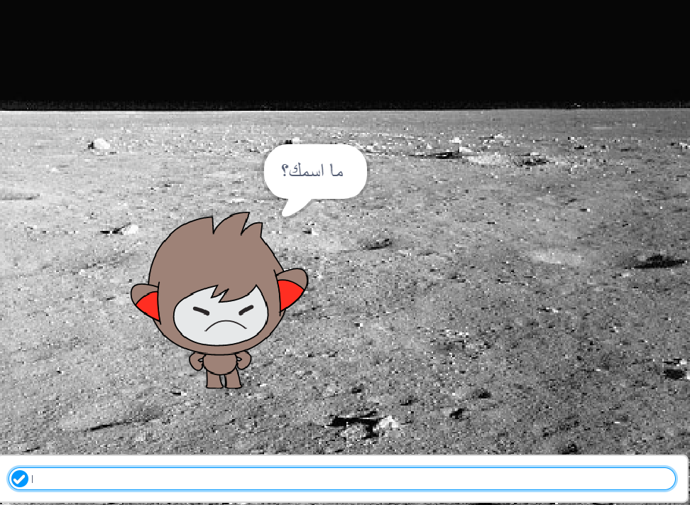

## الخطوة 3: صناعة القرارات

يمكنك برمجة روبوتك ليقرِّر ما سيقوله أو سيفعله بناءً على إجاباتك عن أسئلته.

\--- task \---

هل يمكنك أن تجعل الروبوت يسأل السؤال "هل أنت بخير؟"، وتُبرمجه بحيث يكون ردُّه على المستخدم هو "سعيد لسماع ذلك!" فقط **إذا** كانت إجابة المستخدم عن السؤال هي "نعم"؟

لاختبار التعليمة البرمجية الجديدة كما ينبغي، يجب أن تختبرها **مرتين**، بحيث تكون إجابتك في الاختبار الأول هي "نعم"، وتكون إجابتك في الاختبار الثاني هي "لا".

يجب أن يكون رد الروبوت هو "سعيد لسماع ذلك!" إذا كانت إجابتك هي "نعم"، ولا يرد بأي شيء إذا كانت إجابتك هي "لا".

\--- hints \--- \--- hint \--- بعد أن قال الروبوت "مرحبًا"، يجب أن **يسأل** أيضًا "هل أنت بخير؟". **إذا** كانت إجابتك هي "نعم"، فيجب أن ي**قول** الروبوت "سعيد لسماع ذلك!". \--- /hint \--- \--- hint \--- فيما يلي قوالب التعليمات البرمجية التي ستحتاج إليها:  \--- /hint \--- \--- hint \--- جب أن تكون التعليمة البرمجية التي تُدخلها كما يلي:  \--- /hint \--- \--- /hints \---

\--- /task \---

\--- task \---

حاليًا، لا يقول روبوتك أي شيء عندما تكون إجابتك هي "لا"، هل يمكنك تغيير ذلك بحيث يكون رد الروبوت هو "آسف لسماع ذلك!" إذا كانت إجابتك عن سؤاله هي "لا"؟

اختبر مشروعك وقم بحفظه. الأن يجب أن يقول روبوتك "آسف لسماع ذلك!" إذا كانت إجابتك هي "لا". في الواقع، سيقول الروبوت "آسف لسماع ذلك!" إذا أجبتَ بأي شيء بخلاف "نعم" (فكلمة **وإلا** في القالب `if/else` تعني **خلاف ذلك**).

\--- hints \--- \--- hint \--- يجب أن يقول روبوتك الآن "سعيد لسماع ذلك!" **إذا** كانت إجابتك هي "نعم"، ولكن يجب أن يقول "آسف لسماع ذلك!" إذا كانت إجابتك شيئًا آخر، أيْ **وإلا**. \--- /hint \--- \--- hint \--- فيما يلي قوالب التعليمات البرمجية التي ستحتاج إلى استخدامها:  \--- /hint \--- \--- hint \--- يجب أن تكون التعليمة البرمجية التي تُدخلها كما يلي:  \--- /hint \--- \--- /hints \---

\--- /task \---

\--- task \---

يمكنك إدخال أي تعليمة برمجية في قالب `if/else`، لا مجرد الاقتصار على تعليمة برمجية تجعل روبوتك يتكلم فحسب. If you click your chatbot's **Costume** tab, you'll see that it has more than one costume.

\--- /task \---

\--- task \---

Can you change the chatbot's costume to match your response?

Test and save. You should see your chatbot's face change depending on your answer.

\--- hints \--- \--- hint \--- Your chatbot should now also **switch costume** depending on the answer given. \--- /hint \--- \--- hint \--- Here are the code blocks you'll need to use:  \--- /hint \--- \--- hint \--- Here's how your code should look:  \--- /hint \--- \--- /hints \---

\--- /task \---

\--- task \---

Have you noticed that your chatbot's costume stays the same that it changed to the last time you spoke to it? Can you fix this problem?

Test and save: Run your code and type "no", so that your chatbot looks unhappy. When you run your code again, your chatbot should change back to a smiling face before asking your name.

\--- hints \--- \--- hint \--- When the **sprite is clicked**, your chatbot should first **switch costume** to a smiling face. \--- /hint \--- \--- hint \--- Here's the code block you'll need to add:  \--- /hint \--- \--- hint \--- Here's how your code should look:  \--- /hint \--- \--- /hints \---

\--- /task \---

\--- challenge \---

## Challenge: more decisions

Program your chatbot to ask another question - something with a "yes" or "no" answer. Can you make your chatbot respond to the answer?

 \--- /challenge \---