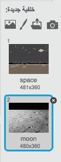
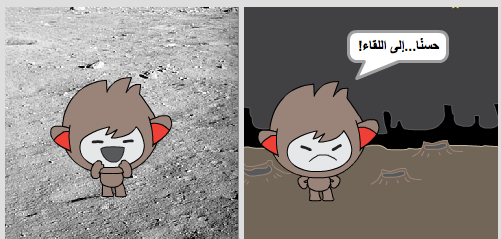
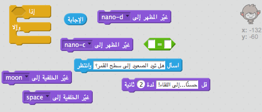
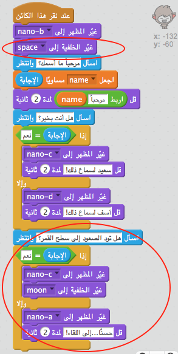
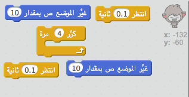
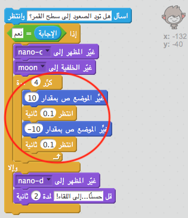

## تغيير المكان

يمكنك أيضًا برمجة روبوتك ليغيِّر مكانه.

+ أضِف خلفية أخرى إلى منصتك، كخلفية 'القمر' مثلًا.

	

+ هل يمكنك برمجة روبوتك ليسأل "هل تود الصعود إلى سطح القمر؟" ثم يغيِّر مكانه إذا كانت إجابتك هي "نعم"؟

    اختبر مشروعك وقم بحفظه. إذا كانت إجابتك هي "نعم"، فيجب أن يغير الروبوت مكانه. ويجب أن يبدو الروبوت حزينًا ويقول "حسنًا...إلى اللقاء!" إذا تم إدخال أي إجابة أخرى.

    

--- hints ---
--- hint ---
يجب أن __يسأل__ الروبوت "هل تود الصعود إلى سطح القمر؟". __إذا__ كانت__إجابتك__ هي "نعم"، فيجب أن __يتغير مظهر__ الروبوت ليبدو سعيدًا ويجب أن تتغير __خلفية__ المنصة.

أما إذا كانت إجابتك هي "لا"، فيجب أن __يتغير مظهر__ الروبوت ليبدو حزينًا و__يقول__ "حسنًا...إلى اللقاء!"

ستحتاج أيضًا إلى إضافة تعليمة برمجية ليبدأ ظهور الروبوت في المكان المناسب __عند النقر عليه__.
--- /hint ---
--- hint ---
فيما يلي قوالب التعليمات البرمجية التي ستحتاج إلى استخدامها:

--- /hint ---
--- hint ---
يجب أن تكون التعليمة البرمجية التي تُدخلها كما يلي:

--- /hint ---
--- /hints ---

+ يمكنك إضافة تعليمة برمجية لتجعل روبوتك يقفز فرحًا إذا أخبرتَه أنك تريد الصعود إلى سطح القمر؟

    اختبر مشروعك وقم بحفظه. إذا كانت إجابتك هي "نعم"، فيجب أن يقفز الروبوت صعودًا وهبوطًا. ويجب ألّا يقفز الروبوت إذا تم إدخال أي إجابة أخرى.

    

--- hints ---
--- hint ---
يجب أن يقفز الروبوت عن طريق __تغيير__ موقع ص __ مسافة صغيرة إلى أعلى، ثم يعود إلى موقعه مرة أخرى بعد __الانتظار__ لفترة قصيرة. قد تحتاج إلى __تكرار__ ذلك عدة مرات.
--- /hint ---
--- hint ---
فيما يلي قوالب التعليمات البرمجية التي ستحتاج إلى استخدامها:

--- /hint ---
--- hint ---
يجب أن تكون التعليمة البرمجية التي تُدخلها كما يلي:

--- /hint ---
--- /hints ---
