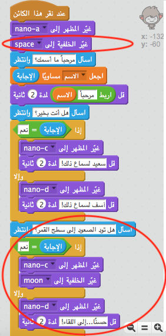

## تغيير المكان

يمكنك أيضًا برمجة روبوتك ليغيِّر مكانه.

\--- task \---

أضِف خلفية أخرى إلى منصتك، كخلفية 'القمر' مثلًا.

\--- /task \---

\--- task \---

هل يمكنك برمجة روبوتك ليسأل "هل تود الصعود إلى سطح القمر؟" ثم يغيِّر مكانه إذا كانت إجابتك هي "نعم"؟

اختبر مشروعك وقم بحفظه. إذا كانت إجابتك هي "نعم"، فيجب أن يغير الروبوت مكانه، ويجب أن يبدو الروبوت حزينًا ويقول "حسنًا...إلى اللقاء!" إذا تم إدخال أي إجابة أخرى.

\--- hints \--- \--- hint \--- يجب أن **يسأل** الروبوت "هل تود الصعود إلى سطح القمر؟". **إذا** كانت **إجابتك** هي "نعم"، فيجب أن **يتغير مظهر** الروبوت ليبدو سعيدًا ويجب أن تتغير **خلفية المنصة**.

أما إذا كانت إجابتك هي "لا"، فيجب أن **يتغير مظهر** الروبوت ليبدو حزينًا و **قول** "حسنًا...إلى اللقاء!"

ستحتاج أيضًا إلى إضافة تعليمة برمجية ليبدأ ظهور الروبوت في المكان المناسب **عند النقر عليه**. \--- /hint \--- \--- hint \--- فيما يلي قوالب التعليمات البرمجية التي ستحتاج إليها:  \--- /hint \--- \--- hint \--- جب أن تكون التعليمة البرمجية التي تُدخلها كما يلي:  \--- /hint \--- \--- /hints \---

\--- /task \---

\--- task \---

هل يمكنك إضافة تعليمة برمجية لتجعل روبوتك يقفز فرحًا إذا أخبرتَه أنك تريد الصعود إلى سطح القمر؟

اختبر مشروعك وقم بحفظه. إذا كانت إجابتك هي "نعم"، فيجب أن يقفز الروبوت صعودًا وهبوطًا. ويجب ألّا يقفز الروبوت إذا تم إدخال أي إجابة أخرى.

\--- hints \--- \--- hint \--- يجب أن يقفز الروبوت عن طريق **تغيير** **موقع ص**مسافة صغيرة إلى أعلى، ثم يعود إلى موقعه مرة أخرى بعد **الانتظار** لفترة قصيرة. You may want to **repeat** this a few times. \--- /hint \--- \--- hint \--- Here are the code blocks you'll need to use:  \--- /hint \--- \--- hint \--- Here's how your code should look:  \--- /hint \--- \--- /hints \---

\--- /task \---