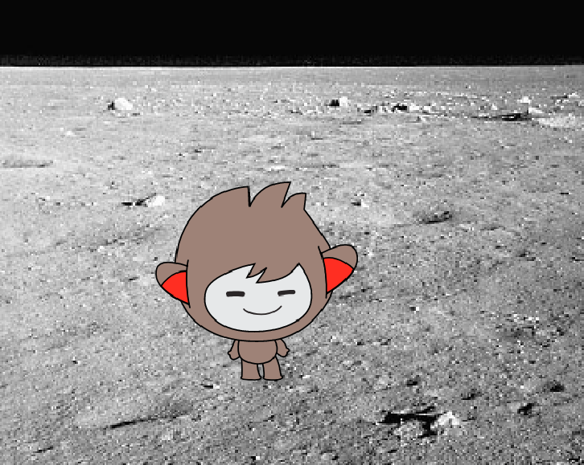

## تغيير المكان

يمكنك أيضًا برمجة روبوتك ليغيِّر مكانه!



\--- task \---

هل يمكنك برمجة روبوتك ليسأل "هل تود الصعود إلى سطح القمر؟" ثم يغيِّر مكانه إذا كانت إجابتك هي "نعم"؟

\--- hints \---

\--- hint \---

يجب أن يسأل روبوتك ` "هل تريد الذهاب إلى القمر؟" ` {: class = "block3sensing"} ، و ` إذا ` {: class = "block3control"} كانت ` الإجابة ` {: class = "block3sensing"} "نعم" ، يجب أن ` تتبدل الخلفية إلى القمر ` {: فئة = "block3looks"}.

\--- hint/ \---

\--- hint \---

فيما يلي الكتل البرمجية التي تحتاج إلى إضافتها إلى روبوت الدردشة الخاصة بك.


```blocks3
غيّر الخلفية الى (moon v)

اسال [هل ترغب بالذهاب الى القمر؟] وانتظر

اذا <(الاجابة)= [yes]> ثم

نهاية
```

\--- hint/ \---

\--- hint \---

و هذا ما يجب أن تبدو عليه التعليمات البرمجية الخاصة بك:

```blocks3
اسال [هل ترغب بالذخاب الى القمر؟] وانتظر
اذا <(الاجابة) = [[yes]>] ثم
  غيّر الخلفية الى (moon v)
نهاية
```

\--- hint/ \---

\--- hints/ \---

\--- /task \---

\--- task \---

تحتاج الآن إلى التأكد من أن الروبوت يبدأ في الموقع الصحيح عند النقر فوقه للتحدث إليه. أضف هذه الكتلة إلى أعلى التعليمات البرمجية للروبوت:


```blocks3
عندما النقر على هذا الكائن

+ غيّر الخلفية ل (space v)
```

\--- /task \---

\--- task \---

اختبر برنامجك، أجب بـ"نعم" عندما يسألك الروبوت هل ترعب بالذهاب الى القمر. يجب أن ترى موقع الروبوت يتغير.

\--- /task \---

\--- task \---

يمكنك أيضًا إضافة الكود التالي داخل ` اذا` {: class = "block3control"} الجديدة لجعل الروبوت يقفز لأعلى ولأسفل أربع مرات إذا أجبت "نعم":


```blocks3
اذا<(الاجابة)= [yes]> ثم
  غيّر الخلفية الى (moon v)

+ كرر (4) مرّة
غيّر الموضع ص بمقدار (10)
انتظر (0.1) ثانية
غّير الموقع ص بمقدار (-10)
انتظر (0.1) ثانية
نهاية
نهاية
```

\--- /task \---