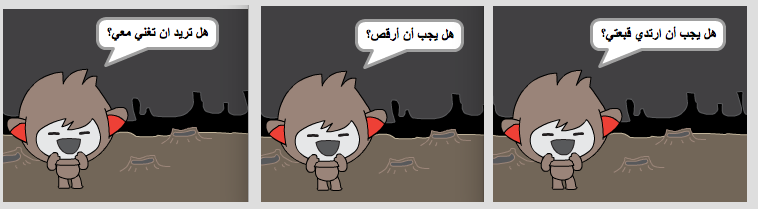

--- challenge ---

## التحدي: إكمال إنشاء روبوتك

استخدم ما تعلمتَه لتُكمل إنشاء روبوتك التفاعلي. إليك بعض الأفكار:

بعد أن تُكمل إنشاء روبوتك، اطلب من أصدقائك التحدث معه! هل يحبون هذه الشخصية؟ هل اكتشفوا أي مشكلات؟ --- /challenge ---
***
### ترجمة المجتمع المساهم

هذا المشروع تم ترجمة بواسطة **عبدالعزيز عبدالله الفائز** ، و مراجعته بواسطة **ريان علي الحمود**

 يساعدنا متطوعونا الرائعون للترجمة في منح الأطفال حول العالم فرصة تعلم البرمجية. يمكنك مساعدتنا في الوصول إلى المزيد من الأطفال عن طريق ترجمة مشاريعنا - اقرأ المزيد على [rpf.io/translators](https://rpf.io/translators).
