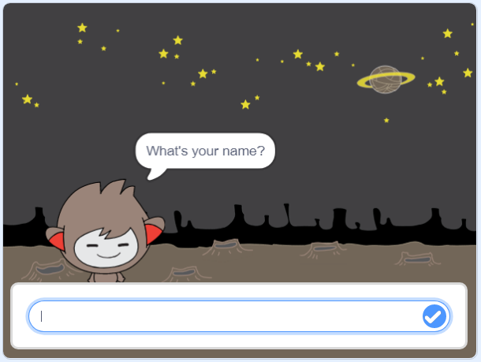

## একটি কথা বলা চ্যাটবট

এখন আপনি একটি ব্যক্তিত্বের সাথে একটি চ্যাটবোট আছে, আপনি এটি আপনার সাথে কথা বলতে প্রোগ্রাম করতে যাচ্ছি।

\--- কাজ \---

আপনার চ্যাটবোট স্প্রাইটে ক্লিক করুন এবং এটিকে এই কোডটি যোগ করুন যাতে `এটি`{ক্লাস = "ব্লক 3events"} ক্লিক করে, এটি `আপনার নাম`{: class = "block3sensing"} এবং তারপর `বলবে "কী সুদৃশ্য নাম!"`{: শ্রেণী = "ব্লক 3looks"}।


```blocks3
যখন এই স্প্রিটটি
জিজ্ঞাসা করে [আপনার নাম কি?] এবং অপেক্ষা করুন [
কি সুন্দর নাম!] (2) সেকেন্ডের জন্য অপেক্ষা করুন
```

\--- /কাজ \---

\--- কাজ \---

আপনার কোড পরীক্ষা করার জন্য আপনার চ্যাটবোট উপর ক্লিক করুন। Chatbot আপনার নাম জন্য অনুরোধ, তখন তা বাক্সে পর্যায় নীচে প্রদর্শিত হবে টাইপ করুন, এবং তারপর নীল চিহ্ন ক্লিক করুন, বা Enter <kbd>লিখুন</kbd>।




\--- /কাজ \---

\--- কাজ \---

এই মুহূর্তে, আপনার চ্যাটবোট উত্তর দেয় "কি সুন্দর নাম!" আপনি উত্তর প্রতিটি সময়। আপনি চ্যাটবোটের উত্তরকে আরো ব্যক্তিগত করতে পারেন, যাতে প্রতিবার ভিন্ন নাম টাইপ করা হলে উত্তর আলাদা হয়।

থেকে chatbot পরী এর কোড পরিবর্তন করুন `যোগদানের`{: শ্রেণি = "block3operators"} "হাই" সঙ্গে `উত্তর`: "কি আপনার নাম" {বর্গ = "block3sensing"} থেকে প্রশ্ন, যাতে কোডটি এইরকম দেখায়:


```blocks3
যখন এই স্প্রিট
ক্লিক করে [আপনার নাম কি?] এবং অপেক্ষা করুন
(যোগ করুন [হাই] (উত্তর) :: +) (2) সেকেন্ডের জন্য
```


\--- /কাজ \---

\--- কাজ \---

একটি **পরিবর্তনশীল**এ উত্তর সংরক্ষণ করে, আপনি আপনার প্রকল্পের যে কোন জায়গায় এটি ব্যবহার করতে পারেন।

নামের একটি নতুন পরিবর্তনশীল তৈরি করুন `নাম`{: শ্রেণি = "block3variables"}।

[[[generic-scratch3-add-variable]]]

\--- /কাজ \---

\--- কাজ \---

এখন, সেট করতে আপনার chatbot sprites এর কোড পরিবর্তন `নাম`: থেকে {বর্গ = "block3variables"} পরিবর্তনশীল `উত্তর`{: শ্রেণি = "block3sensing"}:


```blocks3
যখন এই স্প্রিটটি
প্রশ্নে ক্লিক করে [আপনার নাম কি?] এবং অপেক্ষা করুন +

সেট [নাম্বার]] (উত্তর)
বলুন ([যোগ করুন [হাই] (নাম :: ভেরিয়েবল +)) (2) সেকেন্ডের জন্য
```

আপনার কোডটি আগের মতো কাজ করা উচিত: আপনার চ্যাটবোটটি আপনার টাইপ করা নামটি ব্যবহার করে উচ্চারণ করা উচিত।


\--- /কাজ \---

আবার আপনার প্রোগ্রাম পরীক্ষা করুন। লক্ষ্য করুন যে আপনার টাইপ করা উত্তরটি `নাম্বার`{: class = "block3variables"} ভেরিয়েবলে সংরক্ষণ করা হয় এবং স্টেজের উপরের বাম দিকের কোণায় প্রদর্শিত হয়। To make it disappear from the Stage, go to the `Variables`{:class="block3variables"} blocks section and click on the box next to `name`{:class="block3variables"} so that it is not marked.