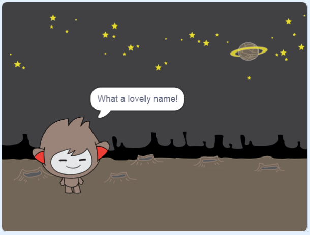

## একটি কথা বলা চ্যাটবট

এখন আপনার কাছে একটি চাটবট আছে যেটার ব্যক্তিত্ব আছে, আপনি সেটি আপনার সাথে কথা বলার জন্য এটি প্রোগ্রাম করতে যাচ্ছেন।.

\--- task \---

আপনার চ্যাটবট sprite ক্লিক করুন এবং এতে এই কোডটি যুক্ত করুন যাতে `when it's clicked`{:class="block3events"}, এটি `asks for your name`{:class="block3sensing"} এবং তারপরে `says "What a lovely name!"`{:class="block3looks"}.


```blocks3
when this sprite clicked
ask [What's your name?] and wait
say [What a lovely name!] for (2) seconds
```

\--- /task \---

\--- task \---

আপনার কোডটি পরীক্ষা করতে আপনার চ্যাটবোটটিতে ক্লিক করুন। চ্যাটবট যখন আপনার নাম জিজ্ঞাসা করবেন, স্টেজের নীচে প্রদর্শিত বাক্সে এটি টাইপ করুন এবং তারপরে নীল চিহ্নটিতে ক্লিক করুন বা<kbd>Enter</kbd> টিপুন.




\--- /task \---

\--- task \---

এই মুহুর্তে, আপনার চ্যাটবোট প্রতিবার উত্তর দেয় "What a lovely name!"। আপনি চ্যাটবটের প্রতিক্রিয়াটিকে আরও ব্যক্তিগত করে তুলতে পারেন, যাতে প্রতিবার একটি আলাদা নাম টাইপ করা হলে উত্তরটি আলাদা হয়।.

চ্যাটবট sprite এর কোড পরিবর্তন করুন এটিতে `join`{: শ্রেণি = "block3operators"} "Hi" সঙ্গে `answer`{:class="block3sensing"} টি এই প্রশ্নে "What's your name?", যাতে কোডটি এইরকম দেখায়:


```blocks3
when this sprite clicked
ask [What's your name?] and wait
say (join [Hi ] (answer) :: +) for (2) seconds
```


\--- /task \---

\--- task \---

উত্তরটি **variable** এ সঞ্চয় করে, আপনি এটি আপনার প্রকল্পের যে কোনও জায়গায় ব্যবহার করতে পারেন।.

`name`{:class="block3variables"} নামে একটি নতুন ভেরিয়েবল তৈরি করুন ।.

[[[generic-scratch3-add-variable]]]

\--- /task \---

\--- task \---

এখন, আপনার চ্যাটবট spriteএর কোডটি পরিবর্তন করতে `name`{:class="block3variables"} variable কে `answer`{:class="block3sensing"} variable এ সেট করুন:


```blocks3
when this sprite clicked
ask [What's your name?] and wait

+ set [name v] to (answer)
say (join [Hi ] (name :: variables +)) for (2) seconds
```

আপনার কোডটি আগের মতোই কাজ করা উচিত: আপনার চ্যাটবটটিতে আপনার টাইপ করা নামটি ব্যবহার করে হাই বলা উচিত।.


\--- /task \---

আপনার প্রোগ্রামটি আবার পরীক্ষা করুন।. লক্ষ্য করুন যে আপনার টাইপ করা উত্তরটি `name`{:class="block3variables"} ভেরিয়েবল এ সঞ্চিত আছে, এবং স্টেজের উপরের বাম-কোণেও প্রদর্শিত হয়।. এটি পর্যায় থেকে অদৃশ্য হয়ে যেতে, `Variables`{:class="block3variables"} ব্লক বিভাগে যান এবং `name`{:class="block3variables"} এর পাশের বাক্সে ক্লিক করুন, যাতে এটি চিহ্নিত না হয়।.