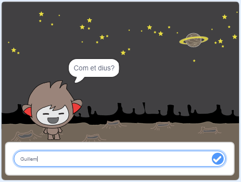

\--- no-print \---

Aquest és la versió **Scratch 3** del projecte. També hi ha una versió de [Scratch 2](https://projects.raspberrypi.org/en/projects/chatbot-scratch2).

\--- /no-print \---

## Introducció

Aprendràs a programar un personatge que pot parlar amb tu! Un personatge que s'anomena robot de xat, o xatbot.

### Què faràs

\--- no-print \---

Fes clic a la bandera verda i, a continuació, fes clic al xatbot per iniciar una conversa. Quan el xat bot fa una pregunta, escriu la teva resposta al quadre a la part inferior de l'escenari i fes clic a la marca blava de la dreta (o prem `Intro`) per veure la resposta del xatbot.

  <iframe allowtransparency="true" width="485" height="402" src="https://scratch.mit.edu/projects/embed/248864190/?autostart=false" 
  frameborder="0" scrolling="no"></iframe>

\--- / no-print \---

\--- només imprimir \---

\--- /print-only \---

## \--- collapse \---

## title: Què necessitaràs

### Maquinari

- Ordinador capaç d'executar Scratch 3

### Programari

- Scratch 3 ( [en línia](https://rpf.io/scratchon) o [fora de línia](https://rpf.io/scratchoff))

### Descàrregues

- [ Trobeu fitxers per descarregar aquí ](http://rpf.io/p/en/chatbot-go).

\--- /collapse \---

## \--- collapse \---

## títol: Què aprendràs

- Utilitzar codi per concatenar cadenes a Scratch
- Conèixer quines variables es poden emprar per guardar entrades de l'usuari
- Utilitzar condicions per respondre a l’entrada de l’usuari a Scratch

\--- /collapse \---

## \--- collapse \---

## title: Notes addicionals per a educadors

\--- no-print \---

Si necessites imprimir aquest projecte, si us plau, utilitza la [versió per imprimir](https://projects.raspberrypi.org/en/projects/chatbot/print){:target="_blank"}.

\--- /no-print \---

Podeu trobar el [projecte complet aquí](http://rpf.io/p/en/chatbot-get).

\--- /collapse \---