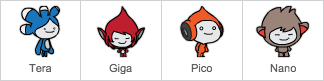

## El teu xatbot

\--- task \---

Abans de començar a crear el teu xatbot, cal decidir la seva personalitat. **Pensa en les següents preguntes**:

+ Quin serà el nom del xatbot?
+ On viu?
+ Està content? Seriós? És divertit? Tímid? Simpàtic?
+ Què li agrada i què no li agrada?

\--- /task \---

\--- task \---

Obre el projecte inicial Xatbot de Scratch.

**En línia:** obre el projecte inicial a [rpf.io/chatbot-on ](http://rpf.io/chatbot-on) {:target = "_ blank"}.

Si tens un compte a Scratch pots fer una còpia fent clic a **Reinventa**.

**Fora de línia:** descarrega el projecte d'inici de [rpf.io/p/en/chatbot-go](http://rpf.io/p/en/chatbot-go){:target= "_ blank"} i, a continuació, obre'l utilitzant l'editor fora de línia.

Si necessites descarregar i instal·lar l'editor Scratch fora de línia, el pots trobar a [https://rpf.io/scratchoff](rpf.io/scratchoff).

\--- /task \---

\--- task \---

El projecte d'inici inclou quatre personatges. Un d'aquests serà el teu xatbot.

Pots utilitzar el personatge que ja està seleccionat, o bé triar-ne un de diferent fent clic al que vulguis i, a continuació, selecciona **mostra** o **amaga** en la icona amb un ull del menú del personatge situat a sota de l’escenari.

\--- /task \---