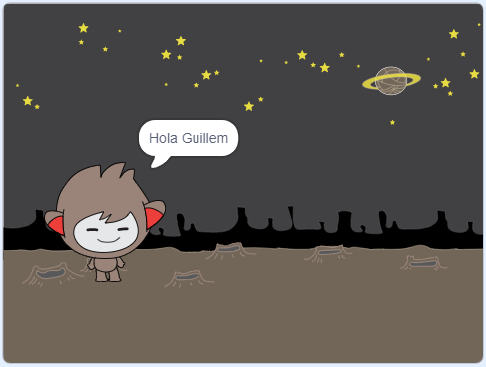

## Un xat bot parlant

Ara que tens un xat bot amb personalitat, programem-lo per a què parli amb tu.

\--- task \---

Feu clic al vostre Sprite de xatbot i afegeix-li aquest codi perquè ` quan li facis clic ` {: class = "block3events"}, ` et demani el teu nom ` {: class = "block3sensing"} i després ` digui "Quin nom tan encantador"! ` {: class = "block3looks"}.


```blocks3
quan cliquis aquest sprite 
pregunta [Quin és el teu nom?] i espera
digues [Quin nom tan encantador!] durant (2) segons
```

\--- /task \---

\--- task \---

Fes clic al teu xatbot per provar el teu codi. Quan el xatbot us demani el vostre nom, escriu-lo al quadre que apareix a la part inferior de l'Escenari i, a continuació, fes clic a la marca blava o prem <kbd> Intro</kbd>.


\--- /task \---

\--- task \---

Ara mateix, el teu xat bot respon "Quin nom tan encantador!" cada vegada que respons. Pots fer que la resposta del xatbot sigui més personal, de manera que la resposta sigui diferent cada vegada que s'escriu un altre nom.

Canvia el codi de l'sprite del xat bot per ` afegir` {: class = "block3operators"} "Hola" amb la ` resposta` {: class = "block3sensing"} a la pregunta "Quin és el teu nom?", perquè el codi es vegi així:


```blocks3
quan cliquis aquest sprite 
pregunta [Quin és el teu nom?] i espera
digues (afegir [hola] (resposta)::+) durant (2) segons
```



\--- /task \---

\--- task \---

En emmagatzemar la resposta en una ** variable**, pots utilitzar-la en qualsevol lloc del teu projecte.

Crea una nova variable anomenada `nom`{:class = "blockvariable"}.

[[[generic-scratch3-add-variable]]]

\--- /task \---

\--- task \---

Ara, canviael codi del sprites del teu xat bot per establir la variable ` nom` {: class = "block3variables"} a ` resposta ` {: class = "block3sensing"}:


```blocks3
quan cliques a aquest sprite
preguntar [Quin és el teu nom?] i espera

+ establir [nom v] a (resposta)
dir (afegir (nom :: variables +)) durant (2) segons
```

El teu codi hauria de funcionar com abans: el teu xat bot hauria de saludar amb el nom que has escrit.


\--- /task \---

Torna a provar el codi. Tingues en compte que la resposta que escrius s'emmagatzema a la variable ` nom` {: class = "block3variables"} i també es mostra a l'extrem superior esquerre de l'Escenari. Per fer que desaparegui de l'Escenari, ves a la secció de blocs ` Dades ` {: class = "block3variables"} i fes clic a la casella que hi ha al costat de `nom ` {: class = "block3variables"} perquè no quedi marcat.