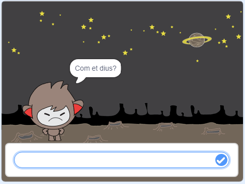

## Prendre decisions

Pots programar el teu xatbot per decidir què ha de dir o fer segons les teves respostes que rep.

En primer lloc, faràs que el teu xatbot faci una pregunta que pugui respondre amb "sí" o "no".

\--- task \---

Canvia el codi del teu xatbot. El teu xatbot hauria de fer la pregunta "Estàs bé nom", utilitzant la variable `nom`{:class="block3variables"}. Aleshores hauria de respondre "És fantàstic escoltar-te!" ` si `{:class="block3control"} la resposta que rep és "sí", però no dir res si la resposta és "no".


```blocks3
when this sprite clicked
ask [What's your name?] and wait
set [name v] to (answer)
say (join [Hi ] (name)) for (2) seconds
+ask (join [Are you OK ] (name)) and wait
+if <(answer) = [yes]> then 
  say [That's great to hear!] for (2) seconds
end
```

Per posar a prova el nou codi correctament, l'hauràs de provar **dues vegades**, una vegada amb la resposta "sí" i una vegada amb la resposta "no".

\--- /task \---

At the moment, your chatbot doesn't say anything to the answer "no".

\--- task \---

Canvia el codi del xatbot perquè respongui "Vaja!" si rep "no" com la resposta a "Estàs bé nom".

Substitueix el bloc `si, llavors`{:class="block3control"} amb un `si, llavors, si no`{:class="block3control"} i inclou el codi perquè el xatbot pugui `dir "Vaja!"`{:class="block3looks"}.


```blocks3
when this sprite clicked
ask [What's your name?] and wait
set [name v] to (answer)
say (join [Hi ] (name)) for (2) seconds
ask (join [Are you OK ] (name)) and wait

+ if <(answer) = [yes]> then 
  say [That's great to hear!] for (2) seconds
else 
+  say [Oh no!] for (2) seconds
end
```

\--- /task \---

\--- task \---

Prova el codi nou. Hauríes d'obtenir una resposta diferent quan respons "no" i quan respons "sí": el teu xatbot hauria de respondre amb "És fantàstic escoltar-te!" quan contestes "sí" (que no distingeix entre majúscules i minúscules), i contestar amb "Vaja!" quan respons **qualsevol altra cosa**.


\--- /task \---

Pots posar qualsevol codi dins d'un bloc `si, llavors, si no`{:class="block3control"}, no només codi per fer que el teu xatbot parli!

Si fas clic a la pestanya **Vestits** del xatbot, veuràs que té més d'un conjunt.


\--- task \---

Canvia el codi del teu xatbot de manera que canviï de disfressa quan escrius la teva resposta.


Canvia el codi de dins del bloc `si, llavors, si no`{:class="block3control"} a `canvia el vestit a`{:class="block3looks"}.


```blocks3
quan es cliqui aquest personatge
pregunta [Com et dius?] i espera
assigna a  [nom v] el valor (resposta)
digues (uneix [hola] (nom)) durant (2) segons
pregunta (uneix [Estàs bé] (nom)) i espera
si <(resposta) = [si]> llavors

+ canvia el vestit a (nano-c v)
  digues [És fantàstic escoltar-te!] durant (2) segons
si no
+ canvia el vestit a (nano-d v)
+ digues [Vaja!] durant (2) segons
fi
```

Prova i desa el teu codi. Hauries de veure com canvia la cara del teu xatbot en funció de la teva resposta.

\--- /task \---

Has notat que, una vegada que el vestit del xatbot ha canviat, es manté així i no canvia al vestit inicial?

Pots provar això: executa el teu codi i respon "no" perquè la cara del xatbot canviï a una aparença infeliç. A continuació, torna a executar el teu codi i observa que el xatbot no canvia de nou per semblar feliç abans de demanar-te el nom.



\--- task \---

Per solucionar aquest problema, afegeix al codi del xatbot el bloc `canvia el vestit`{:class="block3looks"} a l'inici de `quan es cliqui aquest personatge`{:class="block3events"}.


```blocks3
quan es cliqui aquest personatge

+ canvia el vestit a (nano-a v)
pregunta [Com et dius?] i espera
```


\--- /task \---