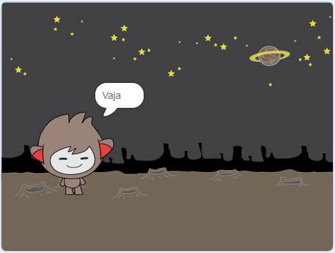
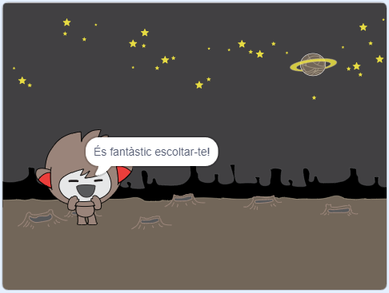

## Prendre decisions

Pots programar el teu xatbot per decidir què ha de dir o fer segons les teves respostes que rep.

En primer lloc, faràs que el teu xatbot faci una pregunta que pugui respondre amb "sí" o "no".

--- task ---

Canvia el codi del teu xatbot. El teu xatbot hauria de fer la pregunta "Estàs bé nom", utilitzant la variable `nom`{:class="block3variables"}. Aleshores hauria de respondre "És fantàstic escoltar-te!" `si`{:class="block3control"} la resposta que rep és "sí", però no dir res si la resposta és "no".


```blocks3
when this sprite clicked
ask [Com et dius?] and wait
set [nom v] to (answer)
say (join [Hola ] (nom)) for (2) seconds
+ask (join [Estàs bé ] (nom)) and wait
+if <(answer) = [si]> then 
  say [És fantàstic escoltar-te!] for (2) seconds
end
```

Per posar a prova el nou codi correctament, l'hauràs de provar **dues vegades**, una vegada amb la resposta "sí" i una vegada amb la resposta "no".

--- /task ---

De moment, el teu xatbot no reacciona a la resposta "no".

--- task ---

Canvia el codi del xatbot perquè respongui "Vaja!" si rep "no" com la resposta a "Estàs bé nom".

Substitueix el bloc `si, llavors`{:class="block3control"} amb un `si, llavors, si no`{:class="block3control"} i inclou el codi perquè el xatbot pugui `dir "Vaja!"`{:class="block3looks"}.


```blocks3
when this sprite clicked
ask [Com et dius?] and wait
set [nom v] to (answer)
say (join [Hola ] (nom)) for (2) seconds
ask (join [Estàs bé ] (nom)) and wait

+ if <(answer) = [si]> then 
  say [És fantàstic escoltar-te!] for (2) seconds
else 
+  say [Vaja!] for (2) seconds
end
```

--- /task ---

--- task ---

Prova el codi nou. Hauríes d'obtenir una resposta diferent quan respons "no" i quan respons "sí": el teu xatbot hauria de respondre amb "És fantàstic escoltar-te!" quan contestes "sí" (que no distingeix entre majúscules i minúscules), i contestar amb "Vaja!" quan respons **qualsevol altra cosa**.




--- /task ---

Pots posar qualsevol codi dins d'un bloc `si, llavors, si no`{:class="block3control"}, no només codi per fer que el teu xatbot parli!

Si fas clic a la pestanya **Vestits** del xatbot, veuràs que té més d'un conjunt.


--- task ---

Canvia el codi del teu xatbot de manera que canviï de disfressa quan escrius la teva resposta.




Canvia el codi de dins del bloc `si, llavors, si no`{:class="block3control"} a `canvia el vestit a`{:class="block3looks"}.


```blocks3
when this sprite clicked
ask [Com et dius?] and wait
set [nom v] to (answer)
say (join [Hola ] (nom)) for (2) seconds
ask (join [Estàs bé ] (nom)) and wait
if <(answer) = [si]> then 
+  switch costume to (nano-c v)
  say [És fantàstic escoltar-te!] for (2) seconds
else 
+  switch costume to (nano-d v)
  say [Vaja!] for (2) seconds
end
```

Prova i desa el teu codi. Hauries de veure com canvia la cara del teu xatbot en funció de la teva resposta.

--- /task ---

Has notat que, una vegada que el vestit del xatbot ha canviat, es manté així i no canvia al vestit inicial?

Pots provar això: executa el teu codi i respon "no" perquè la cara del xatbot canviï a una aparença infeliç. A continuació, torna a executar el teu codi i observa que el xatbot no canvia de nou per semblar feliç abans de demanar-te el nom.


--- task ---

Per solucionar aquest problema, afegeix al codi del xatbot el bloc `canvia el vestit`{:class="block3looks"} a l'inici de `quan es cliqui aquest personatge`{:class="block3events"}.


```blocks3
when this sprite clicked
+ switch costume to (nano-a v)
ask [Com et dius?] and wait
```


--- /task ---