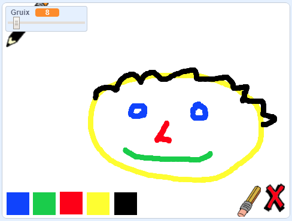

## I ara què ve?

Prova el projecte [Capsa de Pintura](https://projects.raspberrypi.org/en/projects/paint-box?utm_source=pathway&utm_medium=whatnext&utm_campaign=projects), on crearàs el teu propi programa de pintura!

--- no-print ---

Fes clic a la bandera verda per començar. Utilitza el ratolí per moure el llapis i mantingues premut el botó esquerre del ratolí per dibuixar. Fes clic a un color per seleccionar un llapis d'un altre color. Fes clic a la goma per seleccionar-la i utilitzar-la per esborrar el teu treball. Per esborrar tot el dibuix, fes clic a la creu.

  <iframe allowtransparency="true" width="485" height="402" src="//scratch.mit.edu/projects/embed/267243161/?autostart=false" frameborder="0" scrolling="no"></iframe>
  

--- /no-print ---

--- print-only ---

Fes clic a la bandera verda per començar i fes servir el ratolí per moure el llapis i mantingues premut el botó esquerre del ratolí per dibuixar. Si fas clic a un color canviaràs a un altre llapis d'un color diferent, i fent clic a la goma d'esborrar aleshores podràs esborrar!

--- /print-only ---
