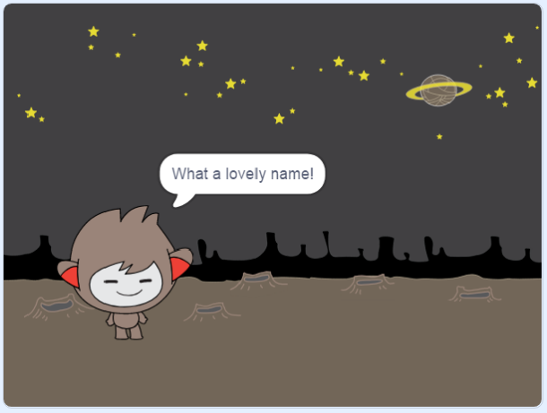

## Mluvící chatbot

Nyní, když máte chatbot s osobností, plánujete to s vámi promluvit.

\--- task \---

Klepněte na vaše chatbot sprite a přidejte tento kód, takže `při jeho kliknutí`{: class = "block3events"}, `zeptá na vaše jméno`{: class = "block3sensing"} a pak `říká " krásné jméno!"`{: class = "block3looks"}.


```blocks3
když tento sprite kliknul
zeptejte se [Jak se jmenuješ?] a počkej
řekni [Co krásné jméno!] za (2) sekundy
```

\--- /task \---

\--- task \---

Kliknutím na chatbot vyzkoušejte svůj kód. Když se chatbot zeptá na vaše jméno, zadejte do pole, které se zobrazí ve spodní části plochy, a klikněte na modrou značku nebo stiskněte <kbd>Zadat</kbd>.




\--- /task \---

\--- task \---

Právě teď vaše chatbot odpoví "Jak krásné jméno!" pokaždé, když odpovíte. Odpověď na chatbot můžete udělat osobnější, takže odpověď se liší při každém zadání jiného jména.

Změňte kód Chatbot spritu na `připojit`{: class = "block3operators"} "Hi" s `odpovědi`: "Jak se jmenujete" {class = "block3sensing"} na otázka, takže kód vypadá takto:


```blocks3
když tento sprite kliknul
zeptejte se [Jak se jmenuje?] a počkejte
řekněte (připojte [Hi] (odpověď) :: +) po dobu (2) sekund
```


\--- /task \---

\--- task \---

Uložením odpověď v **proměnné**, můžete jej použít kdekoli svůj projekt.

Vytvořte novou proměnnou s názvem `název`{: class = "block3variables"}.

[[[generic-scratch3-add-variable]]]

\--- /task \---

\--- task \---

Nyní změňte kód chatbot sprites tak, aby nastavila proměnnou `název`{: class = "block3variables"} na `odpovědi`{: class = "block3sensing"}:


```blocks3
když tento sprite kliknul
zeptejte se [Jak se jmenuje?] a počkejte

+ nastavte [jméno v] na (odpověď)
řekněte (připojte [Hi]
```

Váš kód by měl fungovat stejně jako předtím: Váš chatbot by měl říkat hi používat jméno, které zadáte.


\--- /task \---

Otestujte svůj program znovu. Všimněte si, že odpověď, kterou zadáte, je uložena v proměnné `jméno`{: class = "block3variables"} a je zobrazena také v levém horním rohu Stage. To make it disappear from the Stage, go to the `Variables`{:class="block3variables"} blocks section and click on the box next to `name`{:class="block3variables"} so that it is not marked.