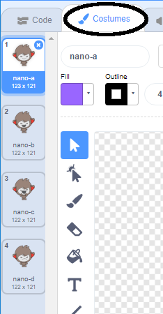

## Rozhodování

Program chatbot můžete naprogramovat tak, aby se rozhodl, co má dělat na základě přijatých odpovědí.

Za prvé, uděláte vaši chatbot otázku, na kterou lze odpovědět "ano" nebo "ne".

\--- task \---

Změňte kód chatbot. Váš chatbot by měl položit otázku "Jste jménem OK" pomocí proměnné `jméno`{: class = "block3variables"}. Pak by měla odpovědět "To je skvělé slyšet!" `pokud`{: class = "block3control"} odpověď, kterou obdrží, je "ano", ale neříkejte nic, pokud je odpověď "ne".


```blocks3
kdy tento sprite klepnutí
ptát [Jak se jmenujete?] a počkejte
sada [název] pro (odpovědí)
Say (připojit [Hi] (název)) po dobu (2) sekund
+ ptát (připojit [jste v pořádku] (jméno)) a počkejte
+ pokud <(odpověď) = [yes]> pak 
  řekněte [To je skvělé slyšet!] po (2) sekundy
konce
```

Chcete-li vyzkoušet nový kód správně, měli byste ho otestovat **dvakrát**: jednou s odpovědí „ano“, a jednou s odpovědí „ne“.

\--- /task \---

V tuto chvíli vaše chatbot neříká odpověď "ne".

\--- task \---

Změňte kód chatbot tak, aby odpovídal "Oh no!" pokud obdrží "ne" jako odpověď na "Jste v pořádku?".

Nahraďte blok `, pak`{block = block3control}} blokem `a pak jiným`{: class = "block3control"} a vložte kód tak, aby chatbot mohl `říct "Oh no!"`{: class = "block3looks"}.


```blocks3
kdy tento sprite klepnutí
ptát [Jak se jmenujete?] a počkejte
sada [název] pro (odpovědí)
Say (připojit [Hi] (název)) po dobu (2) sekundy
ptát (připojit [Jsi OK] ( název)) a počkejte

+ pokud <(odpověď) = [yes]> pak 
  říci [to je skvělé slyšet!] pro (2) sekundy
else 
+ říkají [Oh ne!] pro (2) sekund
konce
```

\--- /task \---

\--- task \---

Otestujte svůj kód. Měli byste odpovědět jinak, když odpovíte "ne" a když odpovíte "ano": vaše chatbot by měl odpovídat "To je skvělé slyšet!" když odpovíte "ano" (což nerozlišuje velká a malá písmena) a odpovězte "Oh no!" když odpovíte **cokoli jiného**.


\--- /task \---

Můžete zadat libovolný kód uvnitř bloku `jestliže tedy ještě`{: class = "block3control"}, ne jen kód, aby vaše chatbot mluvit!

Pokud kliknete na kartu Chatbot **Kostýmy** , zjistíte, že existuje více než jeden kostýmek.



\--- task \---

Změňte kód chatbot tak, aby chatbot přepínal kostýmy při psaní odpovědi.


Změňte kód uvnitř bloku `jestliže pak ještě`{: class = "block3control"} do `přepněte kostým`{: class = "block3looks"}.


```blocks3
kdy tento sprite klepnutí
ptát [Jak se jmenujete?] a počkejte
sada [název] pro (odpovědí)
Say (připojit [Hi] (název)) po dobu (2) sekundy
ptát (připojit [Jsi OK] ( název)) a počkejte
, pokud <(odpověď) = [yes]> pak 

+ přepnout kostým (nano-c v)
  říkají [to je skvělé slyšet!] pro (2) sekund
else 
+ přepínač kostým (nano- d v)
  říká [Oh no!] za (2) sekundy
konce
```

Otestujte a uložte kód. Měli byste vidět změnu tváře chatbotu v závislosti na vaší odpovědi.

\--- /task \---

Všimli jste si, že po tom, co se váš kostýmek chatbot změnil, zůstane takhle a nebude se měnit zpátky na to, co bylo na začátku?

Můžete to vyzkoušet: spusťte svůj kód a odpovězte "ne", aby se vaše tvář chatbotu změnila na nešťastný vzhled. Poté spusťte svůj kód znovu a zjistíte, že váš chatbot se nezmění zpátky a nebude vypadat šťastně, než se zeptá na vaše jméno.


\--- task \---

Chcete-li tento problém vyřešit, přidejte do kódu chatbot `přepnutí kostýmu`{: class = "block3looks"} na začátku `po kliknutí na sprite`{: class = "block3events"}.


```blocks3
kdy tento sprite kliknul

+ přepnout kostým na (nano-a v)
zeptejte se [Jak se jmenuje?] a počkejte
```


\--- /task \---