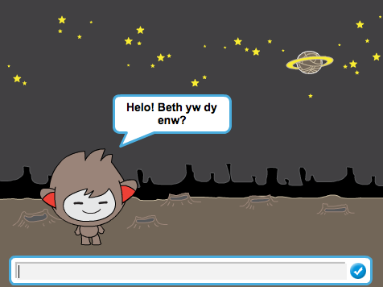

## Cyflwyniad

Rwyt ti mynd i ddysgu sut i raglenni robot dy hunan sydd yn siarad!

  <iframe allowtransparency="true" width="485" height="402" src="https://scratch.mit.edu/projects/embed/26762091/?autostart=false" frameborder="0"></iframe>
  

## Adnoddau
Ar gyfer y prosiect yma, dylid defnyddio Scratch 2.  Mae modd defnyddio Scratch 2 arlein yma [jumpto.cc/scratch-on](http://jumpto.cc/scratch-on) neu mae modd ei lawrlwytho yma [jumpto.cc/scratch-off](http://jumpto.cc/scratch-off) a'i ddefnyddio heb gysylltiad gwe.

Mae modd gweld y prosiect wedi ei gwblhau yma <a href="http://scratch.mit.edu/projects/26762091/#editor">online</a>, neu mae modd ei lawrlwytho wrth glicio ar ddolen 'Adnoddau'r Prosiect' ar gyfer y prosiect yma, sydd yn cynnwys:

+ ChatBot.sb2

## Nodau Dysgu
+ Mewnbynu testun;
+ Penderfyniadau:
	+ datganiadau `os ... wedyn`{:class="blockcontrol"};
	+ datganiadau `os ... wedyn ... fel arall`{:class="blockcontrol"}.

Mae'r prosiect yma yn trin elfennau sydd yn rhan o'r adran ganlynol o [Faes Llafur Gwneud Digidol Raspberry Pi](http://rpf.io/curriculum):

+ [Defnyddio cystrawen iaith raglennu sylfaenol i greu rhaglenni syml.](https://www.raspberrypi.org/curriculum/programming/creator)

## Heriau
+ "Mwy o gwestiynau" - atgyfnerthu dysgu mewnbynu a'r `ateb`{:class="blocksensing"} block;
+ "Mwy o benderfyniadau" - defnyddio penderfyniadau;
+ "Creu SgwrsBot dy hunan" - atgyfnerthu dysgu o hyn a phrosiectau'r gorffennol. 
