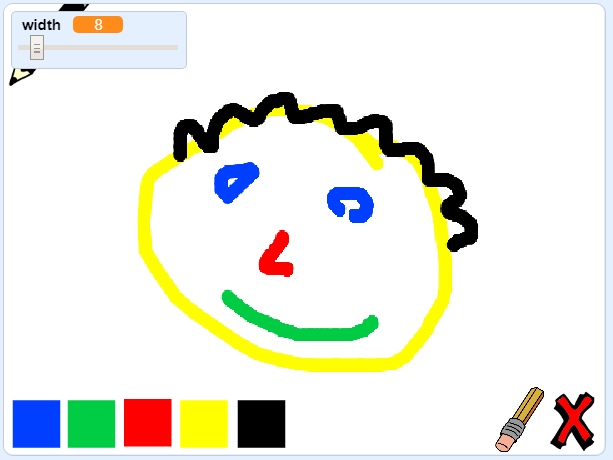

## Beth nesaf?

Rho gynnig ar y prosiect [Bocs peintio](https://projects.raspberrypi.org/cy-GB/projects/paint-box?utm_source=pathway&utm_medium=whatnext&utm_campaign=projects), lle fyddi di'n creu dy raglen peintio dy hunan!

--- no-print --- Clicia'r faner werdd i gychwyn. Defnyddia'r llygoden i symud y pensil, ac dal y botwm chwith ar y llygoden i dynnu llun. Clicia lliw i newid pensiliau. Clicia'r dileuwr i newid iddo, a'i ddefnyddio i ddileu dy waith. I glirio'r dudalen, clicia'r groes.

  <iframe allowtransparency="true" width="485" height="402" src="//scratch.mit.edu/projects/embed/267243161/?autostart=false" frameborder="0" scrolling="no"></iframe>
  

--- /no-print ---

--- print-only --- Fe fyddi di'n clicio'r faner werdd i gychwyn, yna'n defnyddio'r llygoden i symud y pensil a dal botwm chwith y llygoden i dynnu llun. Bydd clicio ar liw yn newid lliw y pensil, a clicio ar y dileuwr yn newid i'r dileuwr!

 --- /print-only ---