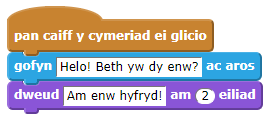
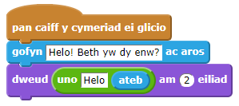
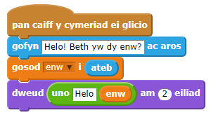
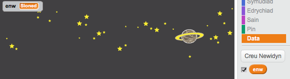
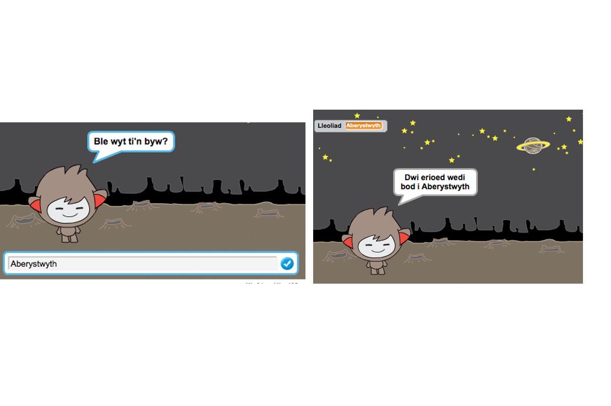

## SgwrsBot sy'n siarad

Nawr bod gen ti SgwrsBot sydd â phersonoliaeth, awn ni ati nesaf i raglenni'r SgwrsBot i siarad gyda ti.

+ Clicia giplun dy SgwrsBot, ac ychwanega y côd yma:

	

+ Clicia ar dy sgwrsbot i'w brofi.  Ar ôl i ti ofyn ei enw, teipia fe mewn i'r bocs ar hyd gwaelod y llwyfan.

	

+ Mae eich sgwrsbot yn ateb 'Am enw hyfryd!' bob tro.  Mae modd personoleiddio ymateb y sgwrsbot, wrth ddefnyddio ateb y defnyddiwr.  Newida gôd y sgwrsbot, fel ei fod yn edrych fel hyn:

  

	I greu y bloc olaf, bydd angen yn gyntaf llusgo y bloc gwyrdd `uno`{:class="blockoperators"}, a'i lusgo ar y bloc `dweud`{:class="blocklooks"}.

	

	Mae modd wedyn newid y testun 'Hello' i ddweud 'Helo', a llusgo y bloc glas golau `ateb`{:class="blocksensing"} (o'r adran 'Synhwyro') ar y testun 'world'.

	

+ Profa y rhaglen newydd yma.  Ydy e'n gweithio fel roeddet ti'n disgwyl? Wyt ti'n gallu trwsio unrhyw broblemau wyt ti'n gallu gweld? (Awgrym: beth am drio ychwanegu bwlch yn rhywle!)

+ Mae'n bosib dy fod di eisiau storio enw'r defnyddiwr fel amrywiad, fel dy fod yn gallu ei ddefnyddio eto.  Cer ati i greu amrywiad newydd `enw`{:class="blockdata"}.  Os wyt ti wedi anghofio sut i wneud hyn, bydd y prosiect 'Ghostbusters' yn gallu dy helpu.

+ Mae'r wybodaeth rwyt ti wedi ei roi i mewn wedi cael ei arbed fel newidyn o'r enw `ateb`{:class="blocksensing"}. Cer i'r grŵp o flociau Synhwyro a chlicia y bloc ateb fel bod tic yn ymddangos.  Fe ddylai gwerth presennol `ateb`{:class="blocksensing"} ymddangos ar ochr top chwith y llwyfan.

+ Unwaith dy fod di wedi creu y newidyn newydd, gwna yn siwr bod côd dy SgwrsBot yn edrych fel hyn:

  

+ Os wyt ti'n profi dy raglen eto, fe fyddi di'n sylwi bod yr ateb yn cael ei arbed yn y newidyn `enw`{:class="blockdata"}, ac yn ymddangos ar ochr top-chwith y llwyfan.  Fe ddylai'r newidyn `enw`{:class="blockdata"} nawr ond gynnwys yr un gwerth â'r newidyn' `ateb`{:class="blocksensing"}.

	

	Os oes well gyda ti beidio gweld y newidyn ar dy lwyfan, yna clica ar y tic drws nesaf i enwau'r amrywiad yn y tab 'Sgriptiau' i'w cuddio nhw.

--- challenge ---
## Her: Mwy o gwestiynau

Rhaglenna dy SgwrsBot i ofyn cwestiwn arall. Wyt ti'n gallu storio'r ateb fel amrywiad?

--- /challenge ---
