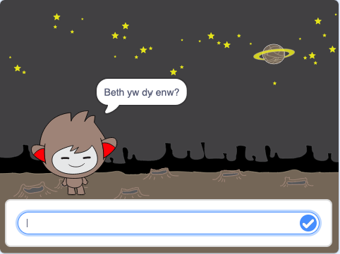
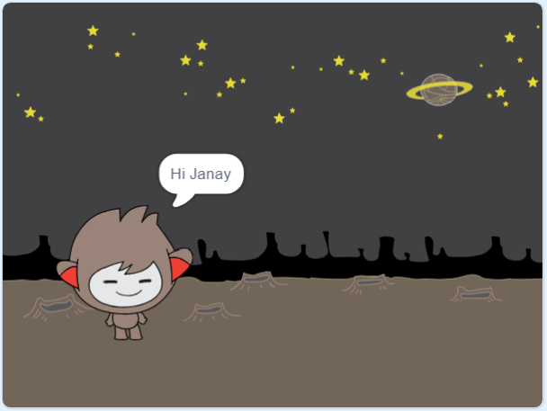

## Sgwrsfot sy'n siarad

Mae gen ti sgwrfot sydd â phersonoliaeth, y cam nesaf yw ei raglenni i siarad â thi.

\--- task \---

Clicia'r corlun sgwrsfot, ac ychwanegu'r côd yma fel ei fod {:class="block3events"} `pan gaiff ei glicio`, yn `gofyn dy enw`{:class="block3sensing"} ac yna `yn dweud "Am enw hyfryd!`{:class="block3looks"}.


```blocks3
when this sprite clicked
ask [What's your name?] and wait
say [What a lovely name!] for (2) seconds
```

\--- /task \---

\--- task \---

Clicia dy sgwrsfot i brofi dy gôd. Pan mae'r sgwrsfot yn gofyn dy enw, teipia dy enw i'r bocs sy'n ymddangos ar waelod y Llwyfan, yna clicio'r marc glas neu gwasgu <kbd>Enter</kbd>.




\--- /task \---

\--- task \---

Mae dy sgwrsfot yn ateb ‘Am enw hyfryd!’ bob tro. Mae modd personoleiddio ymateb y sgwrsbot, fel fod yr ateb yn wahanol bob tro rwyt ti'n teipio dy enw.

Newida côd y sgwrsfot i `uno`{:class="block3operators"} "Helo" gydag `ateb` {:class="block3sensing"} i'r cwestiwn "Beth yw dy enw?", fel fod y côd yn edrych fel hyn:


```blocks3
when this sprite clicked
ask [What's your name?] and wait
say (join [Hi ] (answer) :: +) for (2) seconds
```



\--- /task \---

\--- task \---

Trwy storio'r ateb fel ** newidyn**, mae modd ei ddefnyddio yn unrhyw le yn eich prosiect.

Creu newidyn newydd o'r enw `enw`{:class="block3variables"}.

[[[generic-scratch3-add-variable]]]

\--- /task \---

\--- task \---

Nawr, newida côd dy sgwrsfot i osod y newidyn `enw` {: class = "block3variables}} i `ateb` {: class = "block3sensing"}:


```blocks3
when this sprite clicked
ask [What's your name?] and wait

+ set [name v] to (answer)
say (join [Hi ] (name :: variables +)) for (2) seconds
```

Fe ddylai dy gôd weithio fel o'r blaen: dy sgwrsfot yn dweud helo pan wyt ti'n teipio dy enw.


\--- /task \---

Profa dy raglen eto. Sylwa pan wyt ti'n teipio dy ateb mae'n cael ei arbed yn y newidyn `enw`{:class="block3variables"}, ac hefyd yn ymddangos ar ochr top chwith y Llwyfan. I wneud iddo ddiflannu o'r Llwyfan, cer i adran flociau `Data`{:class="block3variables"} a clicio ar y blwch dros nesaf i `enw`{:class="block3variables"} fel nad yw wedi ei farcio.