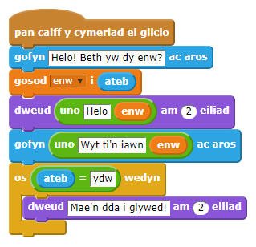
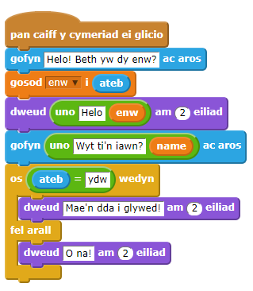
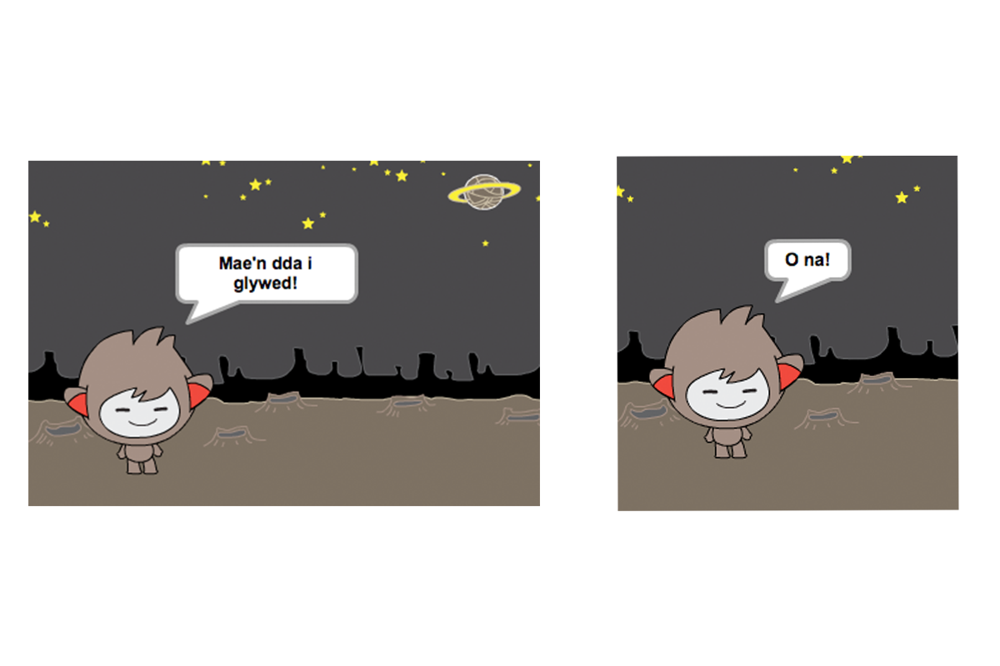
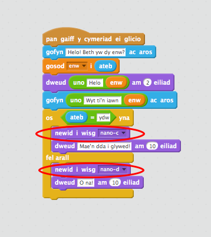
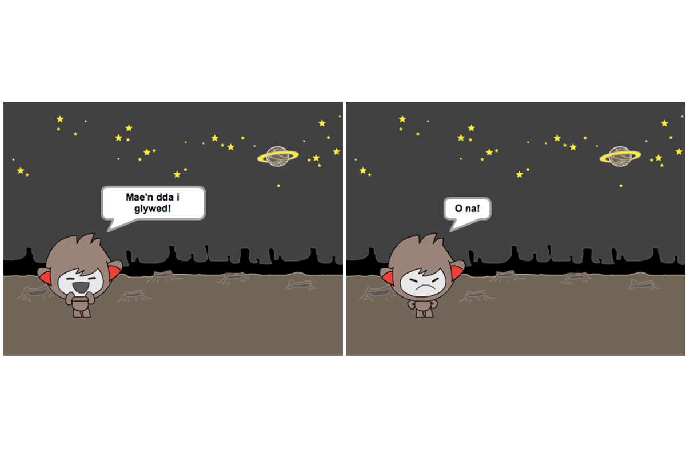

## Gwneud penderfyniadau

Mae modd rhaglenni dy SgwrsBot i ddewis beth i wneud, yn ddibynol ar ymateb y defnyddiwr.

+ Awn ati i wneud i dy SgwrsBot ofyn cwestiwn i'r defnyddiwr sydd ag ateb 'ydw' neu 'nac ydw'. Dyma enghraifft, ond mae modd i ti hefyd newid y cwestiwn:

	

	Sylwa nawr dy fod di wedi arbed dy enw defnyddiwr fel amrywiad, mae modd i ti ei ddefnyddio cymaint a hoffet ti.

+ I brofi y rhaglen yma yn iawn, bydd angen i ti ei brofi ddwywaith - unwaith yn teipio 'nac ydw' fel dy ateb, ac unwaith yn teipio 'ydw'.  Fe ddyle ti ond gael ateb gan dy Sgwrsbot 'os' wyt ti'n ateb 'ydw'.

+ Y broblem gyda dy SgwrsBot yw nad yw e'n ateb os yw'r defnyddiwr yn ateb 'nac ydw'.  Mae modd trwsio hyn trwy newid y bloc `os`{:class="blockcontrol"} i floc `os/wedyn`{:class="blockcontrol"}, fel bod dy gôd yn edrych fel hyn:

	

+ Os wyt ti'n profi dy gôd, fe wnei di nawr weld dy fod yn cal ymateb pan wyt ti'n ateb 'ie' neu 'na'.  Os yw dy sgwrsbot yn ymateb gyda 'Mae hynny'n wych i glywed!' pan wyt ti'n ateb 'ie', ond yn ymateb gyda 'O na!' os wyt ti'n teipio unrhywbeth heblaw 'ie' (`else`{:class="blockcontrol"} means 'otherwise').

	

+ Mae modd i ti roi unrhyw côd yn y bloc `os`{:class="blockcontrol"}  neu `arall`{:class="blockcontrol"}, nid dim ond y côd sy'n gwneud i dy Sgwrsbot siarad. Er enghraifft, mae modd i ti newid gwisg y SgwrsBot i fod yr un peth â'r ymateb.

	Os wyt ti'n edrych ar wisgoedd y SgwrsBot, mae'n bosib y byddi di'n gweld bod mwy nag un. (Os na, mae modd i ti ychwanegu mwy dy hunan!)

	

	Mae modd i ti ddefnyddio'r gwisgoedd yma fel rhan o ymateb dy Sgwrsbot, trwy ychwanegu y côd yma:

	

+ Profa dy raglen, ac fe ddyle ti weld gwyneb dy sgwrsbot yn newid yn dibynnu ar yr ateb rwyt ti'n ei roi.

	

--- challenge ---
## Her: Mwy o benderfyniadau 

Rhaglena dy SgwrsBot i ofyn cwestiwn arall - rhywbeth gydag ateb 'ie' neu 'na'. Wyt ti'n gallu gwneud i dy SgwrsBot ymateb i dy ateb?

--- /challenge ---
