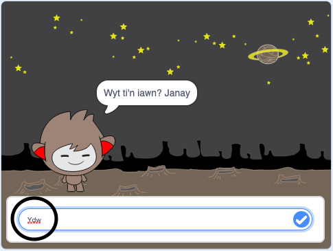
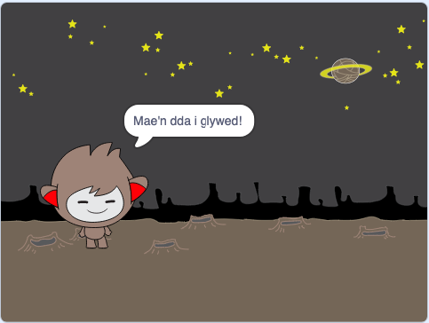
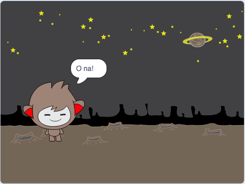
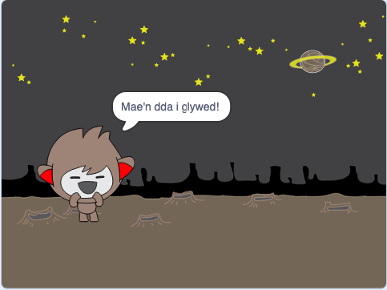
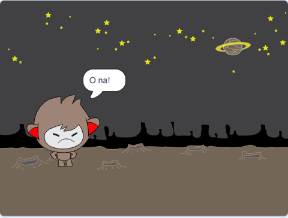
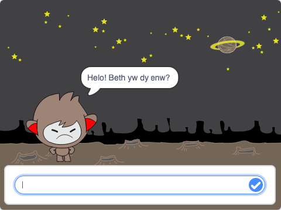
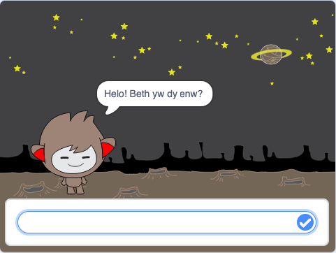

## Gwneud penderfyniadau

Mae modd rhaglenni dy sgwrsfot i ddewis beth i wneud, yn ddibynol ar yr ateb mae'n ei dderbyn.

Yn gyntaf rwyt ti am wneud i dy sgwrsfot ofyn cwestiwn y mae modd ateb gydag "ydw" neu "nac ydw".

\--- task \---

Newida côd dy sgwrsfot. Fe ddylai dy sgwrsfot ofyn y cwestiwn "Wyt ti'n iawn enw", gan ddefnyddio'r newidyn `enw`{:class="block3variables"}. Yna fe ddylai ateb "Mae'n dda i glywed!" `os`{:class="block3control"} mai'r ateb yw "ydw", ond dweud dim os mai'r ateb yw "nac ydw".






```blocks3
when this sprite clicked
ask [What's your name?] and wait
set [name v] to (answer)
say (join [Hi ] (name)) for (2) seconds
+ask (join [Are you OK ] (name)) and wait
+if <(answer) = [yes]> then 
  say [That's great to hear!] for (2) seconds
end
```

I brofi dy gôd newydd, fe ddylet ti ei brofi **ddwywaithi**: unwaith gyda'r ateb "ydw", ac unwaith gyda'r ateb "nac ydw".

\--- /task \---

Ar hyn o bryd, nid yw dy sgwrsfot yn dweud dim wrth yr ateb "nac ydw".

\--- task \---

Newida côd dy sgwrsfot fel ei fod yn ymateb "O na!" pan mae'n derbyn ateb "nac ydw" i'r cwestiwn "Wyt ti'n iawn enw".

Replace the `if, then`{:class="block3control"} block with an `if, then, else`{:class="block3control"} block, and include code so the chatbot can `say "Oh no!"`{:class="block3looks"}.


```blocks3
when this sprite clicked
ask [What's your name?] and wait
set [name v] to (answer)
say (join [Hi ] (name)) for (2) seconds
ask (join [Are you OK ] (name)) and wait

+ if <(answer) = [yes]> then 
  say [That's great to hear!] for (2) seconds
else 
+  say [Oh no!] for (2) seconds
end
```

\--- /task \---

\--- task \---

Test your code. You should get a different response when you answer "no" and when you answer "yes": your chatbot should reply with "That’s great to hear!" when you answer "yes" (which is not case-sensitive), and reply with "Oh no!" when you answer **anything else**.




\--- /task \---

You can put any code inside an `if, then, else`{:class="block3control"} block, not just code to make your chatbot speak!

If you click your chatbot's **Costumes** tab, you'll see that there is more than one costume.


\--- task \---

Change your chatbot's code so that the chatbot switches costumes when you type in your answer.





Change the code inside the `if, then, else`{:class="block3control"} block to `switch costume`{:class="block3looks"}.


```blocks3
when this sprite clicked
ask [What's your name?] and wait
set [name v] to (answer)
say (join [Hi ] (name)) for (2) seconds
ask (join [Are you OK ] (name)) and wait
if <(answer) = [yes]> then 

+  switch costume to (nano-c v)
  say [That's great to hear!] for (2) seconds
else 
+  switch costume to (nano-d v)
  say [Oh no!] for (2) seconds
end
```

Test and save your code. You should see your chatbot's face change depending on your answer.

\--- /task \---

Have you noticed that, after your chatbot's costume has changed, it stays like that and doesn't change back to what it was at the beginning?

You can try this out: run your code and answer "no" so that your chatbot's face changes to an unhappy look. Then run your code again and notice that your chatbot does not change back to looking happy before it asks your name.



\--- task \---

To fix this problem, add to the chatbot's code to `switch costume`{:class="block3looks"} at the start `when the sprite is clicked`{:class="block3events"}.


```blocks3
when this sprite clicked

+ switch costume to (nano-a v)
ask [What's your name?] and wait
```



\--- /task \---