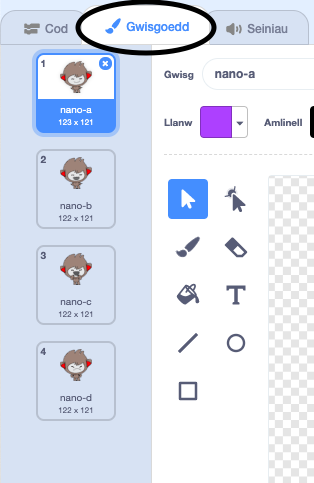

## Gwneud penderfyniadau

Mae modd rhaglenni dy sgwrsfot i ddewis beth i wneud, yn ddibynol ar yr ateb mae'n ei dderbyn.

Yn gyntaf rwyt ti am wneud i dy sgwrsfot ofyn cwestiwn y mae modd ateb gydag "ydw" neu "nac ydw".

\--- task \---

Newida côd dy sgwrsfot. Fe ddylai dy sgwrsfot ofyn y cwestiwn "Wyt ti'n iawn enw", gan ddefnyddio'r newidyn `enw`{:class="block3variables"}. Yna fe ddylai ateb "Mae'n dda i glywed!" `os`{:class="block3control"} mai'r ateb yw "ydw", ond dweud dim os mai'r ateb yw "nac ydw".


```blocks3
pan gaiff y ciplun yma ei glicio
gofyn [Beth yw dy enw?] ac aros
gosod [enw v] i (ateb)
dweud (uno [Helo ] (enw)) am (2) eiliad
+gofyn (uno [Wyt ti'n iawn?] (enw)) ac aros
+os <(ateb) = [ydw]> yna 
  dweud [Mae'n dda i glywed!] am (2) eiliad
end
```

I brofi dy gôd newydd, fe ddylet ti ei brofi **ddwywaithi**: unwaith gyda'r ateb "ydw", ac unwaith gyda'r ateb "nac ydw".

\--- /task \---

Ar hyn o bryd, nid yw dy sgwrsfot yn dweud dim wrth yr ateb "nac ydw".

\--- task \---

Newida côd dy sgwrsfot fel ei fod yn ymateb "O na!" pan mae'n derbyn ateb "nac ydw" i'r cwestiwn "Wyt ti'n iawn enw".

Newida bloc `os`{:class="block3control"} gyda bloc `os, wedyn`{:class="block3control"}, a chynnwys y côd fel bod y sgwrsfot yn gallu `dweud "O na!`{:class="block3control"}.


```blocks3
pan gaiff y ciplun yma ei glicio
gofyn [Beth yw dy enw?] ac aros
gosod [enw v] i (ateb)
dweud (uno [Helo ] (enw)) am (2) eiliad
gofyn (uno [Wyt ti'n iawn?] (enw)) ac aros

+ os <(ateb) = [ydw]> yna
  dweud [Mae'n dda i glywed!] am (2) eiliad
fel arall
+ dweud [O na!] am (2) eiliad
end
```

\--- /task \---

\--- task \---

Profa dy gôd. Fe weli di nawr dy fod yn cal ymateb pan wyt ti’n ateb "ydw" neu "nac ydw". Fe ddylai dy sgwrsfot ymateb gyda "Mae hynny’n wych i glywed!" pan wyt ti’n ateb "ydw", ond yn ymateb gyda "O na!" os wyt ti’n teipio **unrhywbeth arall**.


\--- /task \---

Mae modd i ti roi unrhyw gôd yn y bloc `os neu arall`{:class="block3control"}, nid dim ond y côd sy’n gwneud i dy sgwrsfot siarad.

Os wyt ti’n edrych ar tab **gwisgoedd** y sgwrsfot, fe weli di bod mwy nag un gwisg.



\--- task \---

Newida côd dy sgwrsfot fel fod y sgwrsfot yn newid gwisgoedd pan wyt ti'n teipio dy ateb.


Newida'r côd o fewn y blod `os, yna, wedyn`{:class="block3control"} i `newid gwisg`{:class="block3looks"}.


```blocks3
pan gaiff y ciplun yma ei glicio
gofyn [Beth yw dy enw?] ac aros
gosod [enw] i (ateb)
dweud (uno [Helo ] (enw)) am (2) eiliad
gofyn (uno [Wyt ti'n iawn? ] (enw)) ac aros
os <(ateb) = [yes]> yna
end

+  newid gwisg i (nano-c v)
 dweud [Mae'n dda i glywed!] am (2) eiliad
fel arall
+ newid gwisg i (nano-c v)
 dweud [O na!] for (2) seconds
end
```

Profa ac arbed dy gôd. Fe ddyli di weld gwyneb dy sgwrsfot yn newid yn ddibynol ar dy ateb.

\--- /task \---

Wyt ti wedi sylwi, ar ôl i wisg dy sgwrsfot newid, mae'r arod fel yna a ddim yn newid yn ôl i fel roedd e ar y cychwyn?

Mae modd i ti drio hyn: rhedeg dy gôd ac ateb "nac ydw" fel fod gwyneb dy sgwrsfot yn newid i wyneb anhapus. Rheda'r côd unwaith eto a sylwa nad yw dy sgwrsfot yn newid yn ôl i edrych yn hapus cyn gofyn dy enw.


\--- task \---

I ddatrys y broblem, ychwanega i gôd dy sgwrsfot i `newid gwisg`{:class="block3looks"} ar y cychwyn `pan gaiff y ciplun ei glicio`{:class="block3events"}.


```blocks3
pan gaiff y ciplun yma ei glicio

+ newid gwisg i (nano-a v)
gofyn [Beth yw dy enw?] ac aros
```


\--- /task \---