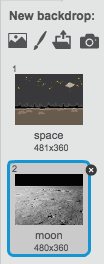

## Newid lleoliad

Mae modd i ti hefyd raglenni dy SgwrsBot i newid lleoliad.

+ Ychwanega cefndir arall i dy lwyfan, er enghraifft cefndir 'lleuad'.

	

+ Mae modd i ti nawr raglenni dy sgwrsbot i newid lleoliad, trwy ychwanegu y côd yma i dy sgwrsbot:

	

+ Mae hefyd angen i ti wneud yn siwr fod dy SgwrsBot tu fas pan wyt ti'n dechrau siarad gydag e.  Ychwanega y bloc yma ar dop côd dy SgwrsBot:

	

+ Profa dy raglen, ac ateba 'ydw' pan mae'n gofyn os wyt ti eisiau mynd i'r lleuad.  Fe ddyle ti weld bod lleoliad y SgwrsBot wedi newid.

	

+ Ydy dy SgwrsBot yn newid lleoliad os wyt ti'n teipio 'na'? Beth am os wyt ti'n teipio 'Dwi ddim yn siwr'?

+ Mae modd i ti hefyd ychwanegu y côd yma yn dy floc `os`{:class="blockcontrol"} i wneud i dy SgwrsBot yn neidio fyny ac i lawr 4 o weithiau os mai 'ie' yw'r ateb:

	

	

+ Profa dy gôd eto.  Ydy dy SgwrsBot yn neidio fyny ac i lawr os wyt ti'n ateb 'ydw'?
