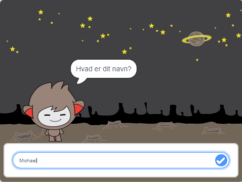

\--- no-print \---

Dette er **Scratch 3** versionen af projektet. Der er også en [Scratch 2 version af projektet](https://projects.raspberrypi.org/en/projects/chatbot-scratch2).

\--- /no-print \---

## Introduktion

Du skal lære at programmere en figur, der kan tale med dig! En figur som der hedder en chatrobot eller chatbot.

### Hvad du vil lave

\--- no-print \---

Klik på det grønne flag, og klik derefter på chatbot-figuren for at starte en samtale. Når chatboten stiller et spørgsmål, skal du skrive dit svar i boksen nederst på skærmen, og derefter klikke på det blå mærke til højre (eller tryk `Enter`) for at se chatbotets svar.

  <iframe allowtransparency="true" width="485" height="402" src="https://scratch.mit.edu/projects/embed/248864190/?autostart=false" 
  frameborder="0" scrolling="no"></iframe>

\--- /no-print \---

\--- print-only \---

\--- /print-only \---

## \--- collapse \---

## Hvad du får brug for

### Hardware

- Computer i stand til at køre Scratch 3

### Software

- Scratch 3 (enten [online](https://rpf.io/scratchon) eller [offline](https://rpf.io/scratchoff))

### Downloads

- [Find filer til download her](http://rpf.io/p/en/chatbot-go).

\--- /collapse \---

## \--- collapse \---

## titel: Du kommer til at lære følgende

- Use code to join text in Scratch
- Vid, at variabler kan bruges til at gemme brugerinput
- Brug betinget valg til at reagere på brugerinput i Scratch

\--- /collapse \---

## \--- collapse \---

## titel: Yderligere noter til undervisere

\--- no-print \---

Hvis du har brug for at udskrive dette projekt, skal du bruge den [ printervenlige version ](https://projects.raspberrypi.org/en/projects/chatbot/print) {: Target = "_ blank"}.

\--- /no-print \---

Du kan finde det [ færdige projekt her ](http://rpf.io/p/en/chatbot-get).

\--- /collapse \---