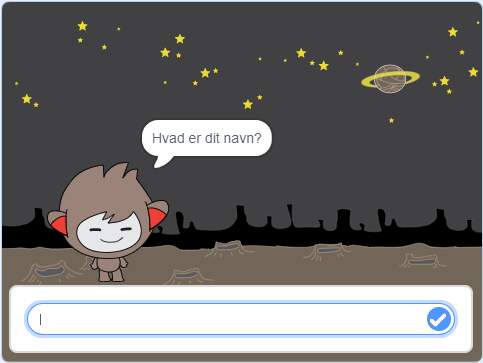
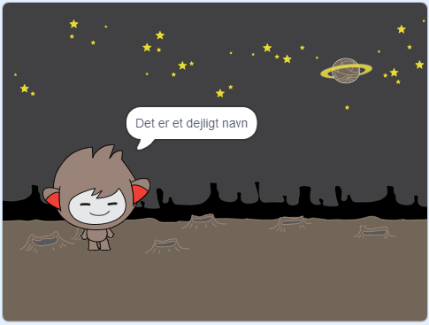

## En snakkende chatbot

Nu hvor du har en chatbot med en personlighed, skal du programmere det til at tale med dig.

\--- task \---

Klik på din chatbot sprite, og tilføj denne kode til den, så `når der klikkes`{: class = "block3events"}, beder den `om dit navn`{: class = "block3sensing"} og derefter siger `"Sikke et dejligt navn! "`{: class = "block3looks"}.


```blocks3
når du klikker på denne sprite
spørg [Hvad er dit navn?] og vent
sige [Sikke et dejligt navn!] i (2) sekunder
```

\--- /task \---

\--- task \---

Klik på din chatbot for at teste din kode. Når chatbot beder om dit navn, skal du skrive det i feltet, der vises nederst på skærmen, og derefter klikke på det blå mærke eller trykke på <kbd>Enter</kbd>.





\--- /task \---

\--- task \---

Lige nu svarer din chatbot "Det er et dejligt navn!" hver gang du svarer. Du kan gøre chatbots svar mere personlige, så svaret er anderledes hver gang et andet navn indtastes.

Skift chatbot sprite kode til `tilslutte`{: class = "block3operators"} "Hej" med `svaret`{: class = "block3sensing"} til "Hvad er dit navn?" spørgsmål, så koden ser sådan ud:


```blocks3
når denne sprite klikket
spørg [Hvad er dit navn?] og vent
sige (join [Hi] (svar) :: +) for (2) sekunder
```


\--- /task \---

\--- task \---

Ved at gemme svaret i en **variabel**, kan du bruge det overalt dit projekt.

Opret en ny variabel kaldet `navn`{: class = "block3variables"}.

[[[generic-scratch3-add-variable]]]

\--- /task \---

\--- task \---

Skift nu din chatbot sprites kode til at indstille `navn`{: class = "block3variables"} variabel til `svar`{: class = "block3sensing"}:


```blocks3
Når denne sprite klikker
spørg [Hvad er dit navn?] og vent

+ sæt [navn v] til (svar)
siger (join [Hi] (navn :: variabler +)) for (2) sekunder
```

Din kode skal fungere som før: din chatbot skal sige hej ved at bruge det navn, du indtaster.


\--- /task \---

Test dit program igen. Bemærk, at svaret du indtaster gemmes i variablen `navn`{: class = "block3variables"}, og vises også øverst til venstre i scenen. Gå til `Variablerne` for at få det til at forsvinde fra scenen </code> {: class = "block3variables"} blok sektionen og klik på boksen ved siden af  navn </0> {: class = "block3variables"}, så det ikke er markeret.</p>