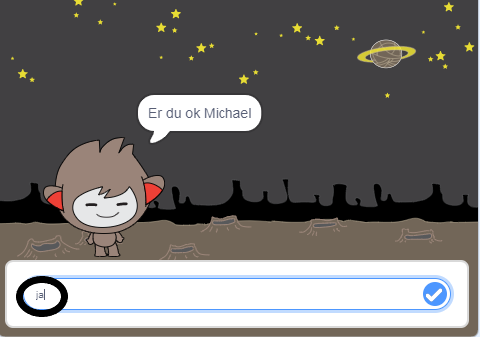
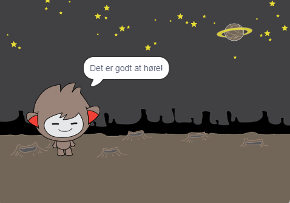
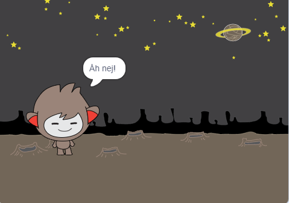
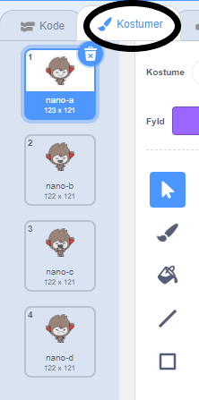
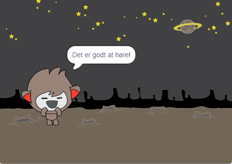
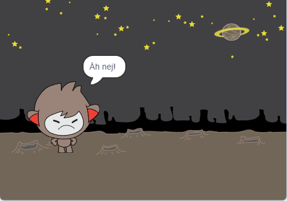
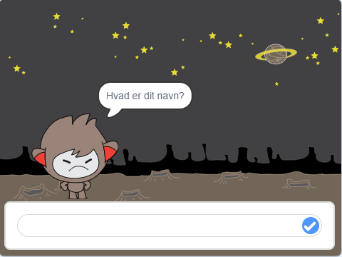
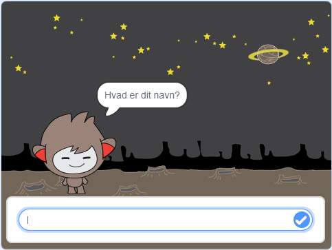

## Tage beslutninger

Du kan programmere din chatbot for at beslutte, hvad du skal gøre, baseret på svarene der modtages.

For det første vil du lave din chatbot stille et spørgsmål, der kan besvares med "ja" eller "nej".

\--- task \---

Skift chatbots kode. Din chatbot skal stille spørgsmålet "Er du OK navn", ved hjælp af variablen `navn`{: class = "block3variables"}. Så skal det svare "Det er dejligt at høre!" `hvis`{: class = "block3control"} svaret det modtager er "ja", men ikke sige noget, hvis svaret er "nej".






```blocks3
når denne sprite klikker
spørg [Hvad er dit navn?] og vent
sæt [navn v] til (svar)
siger (join [Hi] (navn)) til (2) sekunder
+ spørg (join [Er du OK] (navn)) og vent
+ hvis <(svar) = [yes]> så 
  siger [Det er dejligt at høre!] for (2) sekunder
ende
```

For at teste din nye kode korrekt skal du teste den **to gange**: en gang med svaret "ja" og en gang med svaret "nej".

\--- /task \---

I øjeblikket siger din chatbot ikke noget til svaret "nej".

\--- task \---

Skift chatbots kode, så den svarer "Åh nej!" hvis det modtager "nej" som svaret på "Er du OK navn".

Udskift `hvis, så`{: class = "block3control"} blok med en `hvis, da, ellers`{: class = "block3control"} blok, og indeholde kode, så den chatbot kan `sige "Åh nej!"`{: class = "block3looks"}.


```blocks3
når dette sprite klikket
spørg [Hvad er dit navn?] og vent
sæt [navn v] til (svar)
siger (join [Hi] (navn)) til (2) sekunder
spørg navn)) og vent

+ hvis <(svar) = [yes]> så 
  siger [Det er godt at høre!] for (2) sekunder
ellers 
+ siger [Åh nej!] for (2) sekunder
ende
```

\--- /task \---

\--- task \---

Test din kode. Du skal have et andet svar, når du svarer "nej" og når du svarer "ja": din chatbot skal svare med "Det er dejligt at høre!" Når du svarer "ja" (som ikke er sager-følsom), og svar med "Åh nej!" når du svarer **noget andet**.




\--- /task \---

Du kan sætte en kode inde i en `hvis så ellers`{: class = "block3control"} blokere, ikke bare kode for at få din chatbot til at tale!

Hvis du klikker på din chatbots **Kostumer** faneblad, kan du se, at der er mere end et kostume.



\--- task \---

Skift chatbots kode, så chatbot skifter kostumer, når du indtaster dit svar.





Skift kode inde i `hvis ellers`{: class = "block3control"} blokerer til `skift kostume`{: class = "block3looks"}.


```blocks3
når dette sprite klikket
spørg [Hvad er dit navn?] og vent
sæt [navn v] til (svar)
siger (join [Hi] (navn)) til (2) sekunder
spørg navn)) og vent
hvis <(svar) = [yes]> derefter 

+ skift kostume til (nano-c v)
  siger [Det er godt at høre!] til (2) sekunder
ellers 
+ skift kostume til (nano- d v)
  siger [Åh nej!] for (2) sekunder
ende
```

Test og gem din kode. Du bør se din chatbots ansigtsændring afhængigt af dit svar.

\--- /task \---

Har du bemærket, at når din chatbots kostume er ændret, forbliver det sådan og ændrer sig ikke tilbage til hvad det var i begyndelsen?

Du kan prøve dette ud: Kør din kode og svar "nej", så din chatbots ansigt ændrer sig til et ulykkeligt udseende. Kør derefter din kode igen og bemærk, at din chatbot ikke ændres tilbage til at se glad ud, før den spørger dit navn.



\--- task \---

For at løse dette problem skal du føje til chatbots kode til `skifte kostume`{: class = "block3looks"} ved starten `når sprite er klikket`{: class = "block3events"}.


```blocks3
da denne sprite klikte

+ skift kostume til (nano-a v)
spørg [Hvad er dit navn?] og vent
```



\--- /task \---