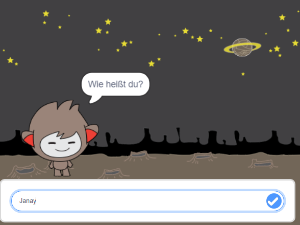

\--- no-print \---

Dies ist die ** Scratch 3 ** Version des Projekts. Es gibt auch eine [ Scratch-2-Version des Projekts ](https://projects.raspberrypi.org/en/projects/chatbot-scratch2).

\--- /no-print \---

## Einleitung

Du wirst lernen, einen Charakter zu programmieren, der mit dir sprechen kann! So ein Charakter wird chat robot, oder chatbot genannt.

### Was du machen wirst

\--- no-print \---

Klicke auf die Grüne Flagge und danach auf das Chatbot-Männchen, um eine Unterhaltung zu beginnen. Wenn der Chatbot eine Frage stellt, tippe deine Antwort in die Box am unteren Ende der Bühne ein und klicke auf den blauen Haken (oder drücke die `Enter` -Taste), um die Antwort des Chatbots zu sehen.

  <iframe allowtransparency="true" width="485" height="402" src="https://scratch.mit.edu/projects/embed/248864190/?autostart=false" 
  frameborder="0" scrolling="no"></iframe>

\--- /no-print \---

\--- print-only \---

\--- /print-only \---

## \--- collapse \---

## title: What you will need

### Hardware

- Computer, der Scratch 3 ausführen kann

### Software

- Scratch 3 (entweder [online](https://rpf.io/scratchon) oder [offline](https://rpf.io/scratchoff))

### Downloads

- [Hier findest du die Dateien zum herunterladen](http://rpf.io/p/en/chatbot-go).

\--- /collapse \---

## \--- collapse \---

## title: What you will learn

- Nutze Code-Blöcke, um Zeichenketten in Scratch zu verketten
- Lerne, dass Variablen zum Speichern von Benutzereingaben verwendet werden können
- Use conditional selection to respond to user input in Scratch

\--- /collapse \---

## \--- collapse \---

## title: Additional notes for educators

\--- no-print \---

If you need to print this project, please use the [printer-friendly version](https://projects.raspberrypi.org/en/projects/chatbot/print){:target="_blank"}.

\--- /no-print \---

You can find the [completed project here](http://rpf.io/p/en/chatbot-get).

\--- /collapse \---