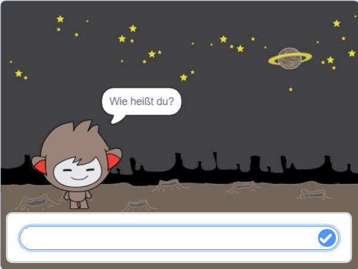
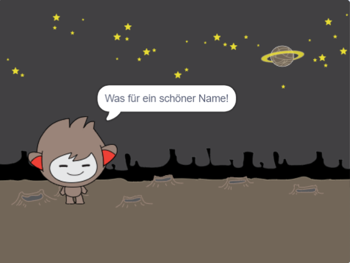
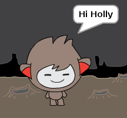

## Ein sprechender Chatbot

Jetzt, wo du einen Chatbot mit einer eigenen Persönlichkeit hast, lass' uns ihn so programmieren, dass er mit dir spricht.

\--- task \---

Klicke auf deinen Chatbot-Sprite und füge diesen Code hinzu, sodass, `wenn darauf geklickt wird ` {: class = "block3events"}, `er nach deinem Namen fragt ` {: class = "block3sensing"} und dann ` "Was für ein schöner Name!" ` {: class = "block3looks"} sagt.


```blocks3
when this sprite clicked
ask [Wie heißt du?] and wait
say [Was für ein schöner Name!] for (2) seconds
```

\--- /task \---

\--- task \---

Klicke auf deinen Chatbot, um deinen Code zu testen. Wenn der Chatbot nach deinem Namen fragt, schreibe ihn in das Feld unten auf der Bühne, und klicke dann auf das blaue Feld, oder drücke <kbd>Enter</kbd>.





\--- /task \---

\--- task \---

Im Moment antwortet dein Chatbot "Was für ein schöner Name!" jedes Mal wenn du antwortest. Du kannst die Antwort des Chatbots persönlicher gestalten, sodass die Antwort jedes Mal anders ist, wenn ein anderer Name eingegeben wird.

Ändere den Sprite Codes des Chatbots to `join`{:class="block3operators"} "Hallo" mit der `answer` (Antwort) {:class="block3sensing"} zu der "Wie heißt du? - Frage, sodass der Code wie folgt aussieht:


```blocks3
when this sprite clicked
ask [What's your name?] and wait
say (join [Hallo ] (answer) :: +) for (2) seconds
```



\--- /task \---

\--- task \---

Wenn du die Antwort in einer **Variable** speicherst, kannst du sie überall in deinem Projekt verwenden.

Erstelle eine neue Variable namens `name`{:class="block3variables"}.

[[[generic-scratch3-add-variable]]]

\--- /task \---

\--- task \---

Ändere den Chatbot Sprite Code nun, um die `name` {:class="block3variables"} Variable auf die `answer` Variable {:class="block3sensing"} umzuändern:


```blocks3
when this sprite clicked
ask [What's your name?] and wait

+ set [name v] to (answer)
say (join [Hi ] (name :: variables +)) for (2) seconds
```

Dein Code sollte wie zuvor funktionieren: dein Chatbot sollte dich mit Hallo und dem Namen, den du eingetippt hast, begrüßen.


\--- /task \---

Teste dein Programm erneut. Beachte, dass die Antwort die du eingibst, in der `name` {:class="block3variables"} Variable gespeichert wird, und auch in der oberen linken Ecke der Bühne angezeigt wird. Um die Variable von der Bühne verschwinden zu lassen, gehe zur `Data`{:class="block3variables"} Block-Abschnitt und klicke auf die Box neben `name`{:class="block3variables"}, sodass sie nicht markiert ist.