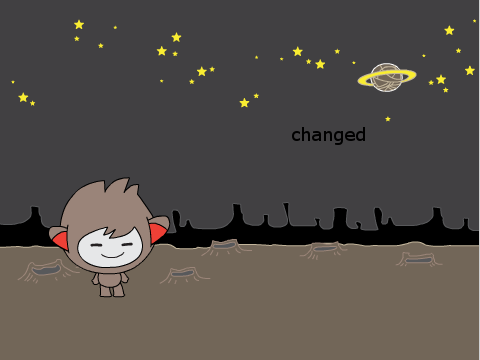

## Dein Chatbot

--- task ---

Bevor du mit deinem Chatbot beginnst, musst du über seine Persönlichkeit entscheiden. **Denke über folgende Fragen nach**:

    + Wie heißt er?
    + Wo lebt er?
    + Ist er fröhlich? Ernst? Lustig? Schüchtern? Freundlich?
    

--- /task ---

--- task ---

Öffne ein neues Scratch-Projekt.

[[[generic-scratch-new-project]]]

--- /task ---

--- task ---

Wähle eine dieser Figuren und füge sie deinem Projekt hinzu:

[[[generic-scratch-sprite-from-library]]]

--- /task ---

--- task ---

Wähle ein Bühnenbild, das zur Persönlichkeit deines Chatbots passt. Hier ist ein Beispiel, deines muss aber nicht so aussehen:

[[[generic-scratch-backdrop-from-library]]]

--- /task ---

--- task ---

Speichere dein Projekt.

[[[generic-scratch-saving]]]

--- /task ---