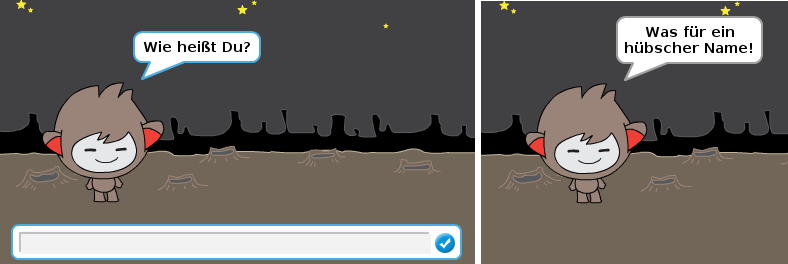
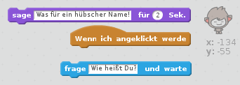
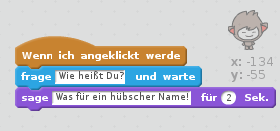
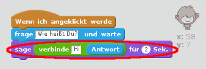
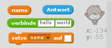
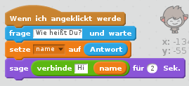
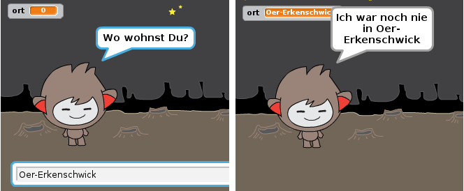

## Ein sprechender Chatbot

Jetzt, wo du einen Chatbot mit einer eigenen Persönlichkeit hast, lass' uns ihn so programmieren, dass er mit dir spricht.

--- task ---

Füge deinem Chatbot Code hinzu, so dass er nach deinem Namen fragt und dann sagt: "Was für ein hübscher Name!", wenn er angeklickt wird.

--- hints --- --- hint --- Wenn die Chatbot- **Figur angeklickt wird**, sollte sie nach deinem Namen **fragen**. Der Chatbot sollte dann "Was für ein hübscher Name!" **sagen**. --- /hint --- --- hint --- Hier sind die Code-Blöcke, die du brauchen wirst:  --- /hint --- --- hint --- So sollte dein Code aussehen:  --- /hint --- --- /hints ---

--- /task ---

--- task ---

Im Moment antwortet der Chatbot einfach jedes Mal: "Was für ein hübscher Name!". Kannst du die Antwort deines Chatbots persönlicher machen, abhängig von deiner Antwort?

--- hints --- --- hint ---Wenn die Chatbot- **Figur angeklickt wird**, sollte sie nach deinem Namen **fragen**. Der Chatbot sollte dann "Hi", gefolgt von deiner **Antwort** **sagen**. --- /hint --- --- hint --- Hier sind die Code-Blöcke, die Du brauchen wirst:  --- /hint --- --- hint --- So sollte dein Code aussehen:  --- /hint --- --- /hints ---

--- /task ---

--- task ---

Wenn du deine Antwort in einer **Variablen** speicherst, kann sie auch später noch verwendet werden. Erstelle eine neue Variable namens `Name` um deinen Namen darin zu speichern.

[[[generic-scratch-add-variable]]]

--- /task ---

--- task ---

Kannst du deine Antwort in der Variablen `Name` speichern und so für die Antwort des Chatbots verwenden?

Dein Code sollte wie zuvor funktionieren: dein Chatbot sollte dich mit deinem Namen begrüßen.

--- hints --- --- hint --- Wenn die Chatbot- **Figur angeklickt wird**, sollte sie nach deinem Namen **fragen**. Du solltest dann die Variable `Name` auf deine **Antwort** **setzen**. Der Chatbot sollte dann "Hi", gefolgt von deiner **Antwort** **sagen**. --- /hint --- --- hint --- Hier sind die Code-Blöcke, die du brauchen wirst:  --- /hint --- --- hint --- So sollte dein Code aussehen:  --- /hint --- --- /hints ---

--- /task ---

--- challenge ---

## Herausforderung: zusätzliche Fragen

Programmiere deinen Chatbot so, dass er eine weitere Frage stellt. Kannst du die neue Antwort in einer neuen Variablen speichern?

 --- /challenge ---
