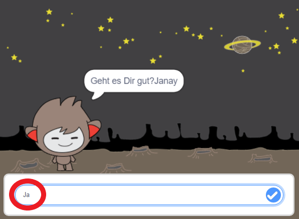
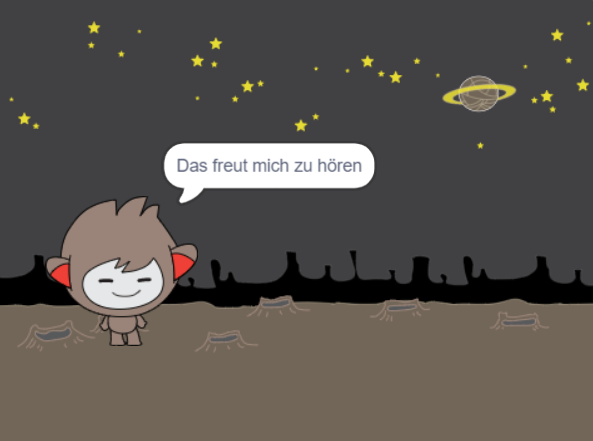
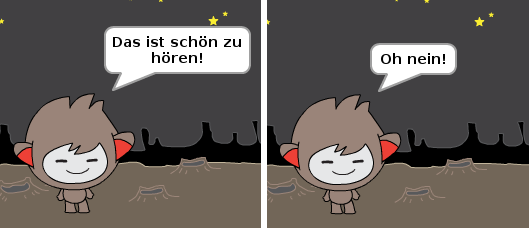
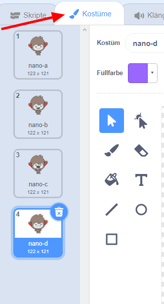
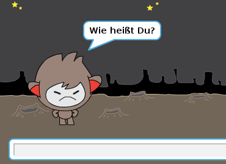
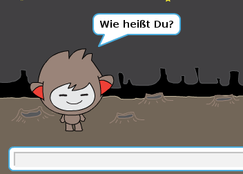

## Entscheidungen treffen

Du kannst deinen Chatbot so programmieren, dass er basierend auf den erhaltenen Antworten entscheidet, was zu tun ist.

Zuerst lässt du deinen Chatbot eine Frage stellen, die mit "Ja" oder "Nein" beantwortet werden kann.

\--- task \---

Ändere den Code deines Chatbots. Dein Chatbot sollte die Frage "Geht's dir gut, Name?, und dabei die `name ` {: class = "block3variables"}-Variable verwenden. Dann sollte er "Das freut mich zu hören!" antworten, `wenn`{:class="block3control"} die Antwort, die er bekommt "ja" ist, aber nichts sagen, wenn die Antwort "nein" ist.






```blocks3
wenn diese Figur angeklickt wird
frage[Wie heißt du?] und warte
setze [name v] auf (Antwort)
sage (teilnehmen [Hallo ] (name)) für (2) Sekunden
+ frage (teilnehmen [Geht es Dir gut?] (name)) und warte
+ wenn <(Antwort) = [Ja]> dann  
   sage [Das freut mich zu hören!] für (2) Sekunden
end
```

Um deinen neuen Code korrekt zu testen, solltest Du ihn **zweimal** ausprobieren, einmal mit der Antwort "ja" und einmal mit "nein".

\--- /task \---

Im Moment sagt dein Chatbot nichts, wenn die Antwort "nein" ist.

\--- task \---

Ändere den Code deines Chatbots so, dass er "Oh nein!" antwortet, wenn er "nein" als Antwort auf "Gehts dir gut, name" erhält.

Ersetze den `wenn, dann`{:class="block3control"} Block mit einem `wenn, dann, sonst` {:class="block3control"} Block, und verwende einen Code, damit der Chatbot sagen kann `"Oh nein!"`{:class="block3looks"}.


```blocks3
wenn diese Figur angeklickt wird
frage[Wie heißt du?] und warte
setze [name v] auf (Antwort)
sage (teilnehmen [Hallo ] (name)) für (2) Sekunden
+ frage (teilnehmen [Geht es Dir gut?] (name)) und warte

+ wenn <(Antwort) = [Ja]> dann  
   sage [Das freut mich zu hören!] für (2) Sekunden
sonst 
+ sage [Oh nein!] für (2) Sekunden
end
```

\--- /task \---

\--- task \---

Teste deinen Code nochmals. Du solltest eine andere Antwort erhalten, wenn du mit "Nein" und mit "ja" antwortest: Dein Chatbot sollte mit "Das freut mich zu hören!" antworten, wenn du mit "ja" antwortest (ohne Berücksichtigung der Groß- und Kleinschreibung) und mit "Oh nein!" wenn du **etwas anderes antwortest **.




\--- /task \---

Du kannst jeden Code in einen `falls, dann, sonst`{:class="block3control"} Block legen, nicht nur Code, dass dein Chatbot spricht!

Wenn du deines Chatbot **Kostüme** Reiter klickst, wirst du sehen, dass deine Figur mehr als ein Kostüm hat.



\--- task \---

Ändere den Code deines Chatbots so, dass der Chatbot sein Kostüme wechselt, wenn du deine Antwort eingeben hast.


Ändere den Code im `falls, dann, sonst` {: class = "block3control"} Block um das `Kostüm zu wechseln` {: class = "block3looks"}.


```blocks3
wenn diese Figur angeklickt wird
frage[Wie heißt du?] und warte
setze [name v] auf (Antwort)
sage (teilnehmen [Hallo ] (name)) für (2) Sekunden
frage (teilnehmen [Geht es Dir gut?] (name)) und warte
wenn <(Antwort) = [Ja]> dann  

+  wechsle zu Kostüm (nano-c v)
   sage [Das freut mich zu hören!] für (2) Sekunden
sonst 
+  wechsle zu Kostüm (nano-d v)
  sage [Oh nein!] für (2) Sekunden
end
```

Speicher und teste deinen Code. Du solltest sehen, wie sich das Gesicht deines Chatbots ändert wenn du deine Antwort eingibst.

\--- /task \---

Ist dir aufgefallen, dass das Kostüm deines Chatbots nach dem Wechsel so bleibt und sich nicht mehr zu dem Kostüm wechselt, wie es am Anfang war?

Du kannst es ausprobieren: Führe deinen Code aus und antworte "Nein", so dass sich das Gesicht deines Chatbots zu einem unglücklichen Aussehen ändert. Führe dann deinen Code erneut aus und stelle fest, ob dein Chatbot erst dann wieder glücklich aussieht, wenn er dich nach deinen Namen gefragt hat.



\--- task \---

Um das Problem zu beheben, füge ein `wechsle zu Kostüm`{:class="block3looks"} am Anfang zu `wenn diese Figur angeklickt wird`{:class="block3events"} hinzu.


```blocks3
wenn diese Figur angeklickt wird

+ wechsle zu Kostüm (nano-a v)
frage [Wie heißt du?] und warte
```



\--- /task \---