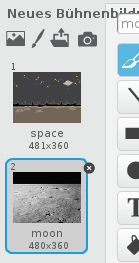

## Ort ändern

Du kannst den SprechBot so programmieren, dass er den Ort wechselt.

+ Füge einen weiteren Hintergrund zu Deiner Bühne hinzu, zum Beispiel den Mond-Hintergrund.

	

+ Du kannst den SprechBot nun programmieren den Ort zu wechseln, indem Du ihm diesen Code hinzufügst:

	```blocks
  frage [Ich fliege zum Mond. Möchtest Du mit mir kommen?] und warte
falls ((Antwort) = [ja]) dann
   wechsle zu Bühnenbild [moon v]
Ende
	```

+ Du musst darüber hinaus sicherstellen, dass Dein SprechBot im Weltraum ist wenn Du beginnst mit ihm zu sprechen. Füge diesen Block an den Anfang Deines SprechBot-Codes hinzu:

	

+ Teste Dein Programm und antworte mit `ja`, wenn Du danach gefragt wirst, ob Du zum Mond fliegen möchtest. Du solltest nun sehen, dass sich die Umgebung des SprechBots ändert.

	

+ Ändert sich der Aufenthaltsort des SprechBots, wenn Du `nein` als Antwort eintippst? Was passiert, wenn Du `Ich bin mir nicht sicher` antwortest?

+ Du kannst auch diesen Code in Deinen `wenn` {.blockcontrol}-Block hinzufügen, um Deinen SprechBot vier Mal hoch- und runterspringen zu lassen, wenn die Antwort `ja` lautet:

	```scratch
  wiederhole (4) mal
   ändere y um (10)
   warte (0.1) Sek.
   ändere y um (-10)
   warte (0.1) Sek.
Ende
	```

	

+ Teste erneut Deinen Code. Springt Dein SprechBot auf und ab, wenn Du `ja` antwortest?
