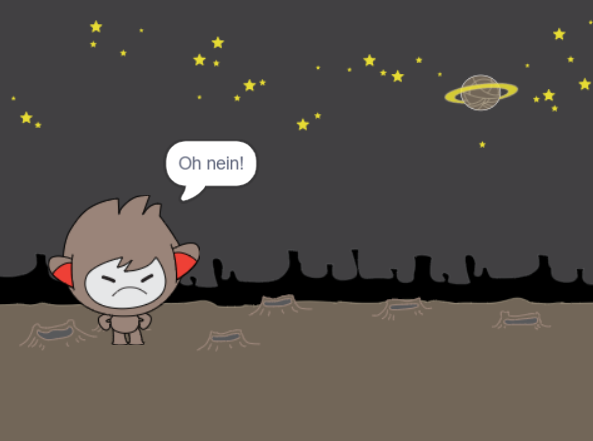
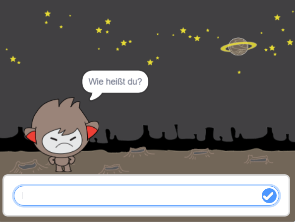

## Entscheidungen treffen

Du kannst deinen Chatbot so programmieren, dass er basierend auf den erhaltenen Antworten entscheidet, was zu tun ist.

Zuerst lässt du deinen Chatbot eine Frage stellen, die mit "Ja" oder "Nein" beantwortet werden kann.

\--- task \---

Ändere den Code deines Chatbots. Dein Chatbot sollte die Frage "Geht's dir gut, Name?, und dabei die `name ` {: class = "block3variables"}-Variable verwenden. Dann sollte er "Das freut mich zu hören!" antworten, `wenn`{:class="block3control"} die Antwort, die er bekommt "ja" ist, aber nichts sagen, wenn die Antwort "nein" ist.


```blocks3
when this sprite clicked
ask [Wie heißt du?] and wait
set [name v] to (answer)
say (join [Hallo ] (name)) for (2) seconds
+ask (join [Geht's dir gut ] (name)) and wait
+if <(answer) = [ja]> then 
  say [Das freut mich!] for (2) seconds
end
```

Um deinen neuen Code korrekt zu testen, solltest Du ihn **zweimal** ausprobieren, einmal mit der Antwort "ja" und einmal mit "nein".

\--- /task \---

Im Moment sagt dein Chatbot nichts, wenn die Antwort "nein" ist.

\--- task \---

Ändere den Code deines Chatbots so, dass er "Oh nein!" antwortet, wenn er "nein" als Antwort auf "Gehts dir gut, name" erhält.

Ersetze den `if, then`{:class="block3control"} Block mit einem `if, then, else` {:class="block3control"} Block, and verwende Code, damit der Chatbot sagen kann `"Oh nein!"`{:class="block3looks"}.


```blocks3
when this sprite clicked
ask [Wie heißt du?] and wait
set [name v] to (answer)
say (join [Hallo ] (name)) for (2) seconds
ask (join [Geht's dir gut ] (name)) and wait

+ if <(answer) = [yes]> then 
  say [Das freut mich zu hören!] for (2) seconds
else 
+  say [Oh nein!] for (2) seconds
end
```

\--- /task \---

\--- task \---

Teste deinen Code nochmals. Du solltest eine andere Antwort erhalten, wenn du mit "Nein" und mit "ja" antwortest: Dein Chatbot sollte mit "Das freut mich zu hören!" antworten, wenn du mit "ja" antwortest (ohne Berücksichtigung der Groß- und Kleinschreibung) und mit "Oh nein!" wenn du **etwas anderes antwortest **.


\--- /task \---

You can put any code inside an `if, then, else`{:class="block3control"} block, not just code to make your chatbot speak!

If you click your chatbot's **Costumes** tab, you'll see that there is more than one costume.


\--- task \---

Change your chatbot's code so that the chatbot switches costumes when you type in your answer.




Change the code inside the `if, then, else`{:class="block3control"} block to `switch costume`{:class="block3looks"}.


```blocks3
when this sprite clicked
ask [What's your name?] and wait
set [name v] to (answer)
say (join [Hi ] (name)) for (2) seconds
ask (join [Are you OK ] (name)) and wait
if <(answer) = [yes]> then 

+  switch costume to (nano-c v)
  say [That's great to hear!] for (2) seconds
else 
+  switch costume to (nano-d v)
  say [Oh no!] for (2) seconds
end
```

Test and save your code. You should see your chatbot's face change depending on your answer.

\--- /task \---

Have you noticed that, after your chatbot's costume has changed, it stays like that and doesn't change back to what it was at the beginning?

You can try this out: run your code and answer "no" so that your chatbot's face changes to an unhappy look. Then run your code again and notice that your chatbot does not change back to looking happy before it asks your name.



\--- task \---

To fix this problem, add to the chatbot's code to `switch costume`{:class="block3looks"} at the start `when the sprite is clicked`{:class="block3events"}.


```blocks3
when this sprite clicked

+ switch costume to (nano-a v)
ask [What's your name?] and wait
```


\--- /task \---