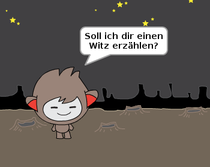

## Herausforderung: zusätzliche Entscheidungen

Programmiere deinen Chatbot so, dass er eine andere Frage stellt, die mit "ja" oder "nein" beantwortet werden kann. Kannst deinen Chatbot dazu bringen, unterschiedlich zu reagieren, je nachdem welche Antwort er erhält?

